# Software Requirements Document (SRD)
## Pricelock Split Payment Feature - Rail Ninja Platform

---

## DOCUMENT CONTROL

| **Attribute** | **Details** |
|---------------|-------------|
| **Document Title** | Software Requirements Document - Pricelock Feature |
| **Project** | Rail Ninja Booking Platform - Split Payment Implementation |
| **Version** | 1.0 |
| **Date** | December 11, 2025 |
| **Status** | Final for Review |
| **Prepared By** | Business Analyst |
| **Organization** | Firebird Tours |

### Version History

| Version | Date | Author | Changes |
|---------|------|--------|---------|
| 0.1 | 2025-12-10 | BA Team | Initial draft - Requirements baseline |
| 0.5 | 2025-12-11 | BA Team | Added UI specs, flows, use cases |
| 1.0 | 2025-12-11 | BA Team | Complete SRD - Ready for review |

### Document Approval

| Role | Name | Signature | Date |
|------|------|-----------|------|
| Product Manager | [Pending] | | |
| Lead Developer | [Pending] | | |
| QA Lead | [Pending] | | |
| Business Analyst | [Your Name] | | 2025-12-11 |

### Related Documents

| Document | Location | Purpose |
|----------|----------|---------|
| **Interview Elicitation Results** | 01_interview_elicitation_results.md | Requirements source |
| **Rail Ninja Web Analysis** | 02_rail_ninja_web_analysis.md | Platform analysis |
| **Assumptions & Decisions** | 03_assumptions_and_decisions.md | Decision log |
| **Test Cases (Detailed)** | Test_Cases_Pricelock.md | Full test specifications |
| **Wireframe Files** | Wireframe_1.html to Wireframe_5.html | Interactive prototypes |
| **AI Prompts Documentation** | AI_Prompts_Documentation.md | Transparency record |

---

## TABLE OF CONTENTS

1. [Executive Summary](#1-executive-summary)
   - 1.1 [Purpose](#11-purpose)
   - 1.2 [Scope](#12-scope)
   - 1.3 [Key Highlights](#13-key-highlights)

2. [Introduction](#2-introduction)
   - 2.1 [Project Background](#21-project-background)
   - 2.2 [Document Purpose](#22-document-purpose)
   - 2.3 [Intended Audience](#23-intended-audience)
   - 2.4 [Document Conventions](#24-document-conventions)

3. [Feature Description](#3-feature-description)
   - 3.1 [Customer-Facing Description](#31-customer-facing-description)
   - 3.2 [Operational-Facing Description](#32-operational-facing-description)

4. [Requirements Specification](#4-requirements-specification)
   - 4.1 [Functional Requirements](#41-functional-requirements)
   - 4.2 [Business Rules](#42-business-rules)
   - 4.3 [Non-Functional Requirements](#43-non-functional-requirements)
   - 4.4 [Data Requirements](#44-data-requirements)
   - 4.5 [Integration Requirements](#45-integration-requirements)

5. [User Interface Specifications](#5-user-interface-specifications)
   - 5.1 [Design System](#51-design-system)
   - 5.2 [Wireframes](#52-wireframes)
   - 5.3 [UI Components](#53-ui-components)

6. [User Flows](#6-user-flows)
   - 6.1 [Checkout Flow](#61-checkout-flow)
   - 6.2 [Personal Cabinet Flow](#62-personal-cabinet-flow)
   - 6.3 [Payment 2 Flow](#63-payment-2-flow)
   - 6.4 [Cancellation Flow](#64-cancellation-flow)

7. [Use Cases](#7-use-cases)
   - 7.1 [Use Case Index](#71-use-case-index)
   - 7.2 [Detailed Use Cases](#72-detailed-use-cases)

8. [Operational Flows](#8-operational-flows)
   - 8.1 [Payment 1 Processing](#81-payment-1-processing)
   - 8.2 [Personal Cabinet View](#82-personal-cabinet-view)
   - 8.3 [Payment 2 Processing](#83-payment-2-processing)
   - 8.4 [Reminder System](#84-reminder-system)
   - 8.5 [Grace Period & Auto-Cancellation](#85-grace-period--auto-cancellation)
   - 8.6 [User-Initiated Cancellation](#86-user-initiated-cancellation)
   - 8.7 [Error Handling](#87-error-handling)

9. [Acceptance Criteria](#9-acceptance-criteria)
   - 9.1 [Checkout & Payment 1](#91-checkout--payment-1)
   - 9.2 [Personal Cabinet & Payment 2](#92-personal-cabinet--payment-2)
   - 9.3 [Reminders](#93-reminders)
   - 9.4 [Grace Period & Cancellation](#94-grace-period--cancellation)
   - 9.5 [Edge Cases](#95-edge-cases)

10. [Test Strategy](#10-test-strategy)
    - 10.1 [Test Approach](#101-test-approach)
    - 10.2 [Test Levels](#102-test-levels)
    - 10.3 [Test Cases Summary](#103-test-cases-summary)

11. [Assumptions & Constraints](#11-assumptions--constraints)
    - 11.1 [Critical Assumptions](#111-critical-assumptions)
    - 11.2 [Additional Assumptions](#112-additional-assumptions)
    - 11.3 [Constraints](#113-constraints)

12. [Traceability Matrix](#12-traceability-matrix)
    - 12.1 [Requirements Coverage](#121-requirements-coverage)
    - 12.2 [Assumptions to Requirements](#122-assumptions-to-requirements)

13. [Glossary](#13-glossary)

14. [Appendices](#14-appendices)

---

<a id="1-executive-summary"></a>
## 1. EXECUTIVE SUMMARY

<a id="11-purpose"></a>
### 1.1 Purpose

This Software Requirements Document (SRD) specifies the complete requirements for implementing the **Pricelock split payment feature** on Rail Ninja's booking platform. Pricelock allows customers to divide their booking payment into two installments: an initial payment at booking and a second payment due 14 days before departure.

**Business Objective:** Reduce booking abandonment by offering payment flexibility while maintaining full revenue collection.

<a id="12-scope"></a>
### 1.2 Scope

**In Scope:**
- Split payment option at checkout (last step only)
- Payment 1 processing (service fee + 20% of ticket)
- Payment 2 management via Personal Cabinet
- Automated reminder system (email notifications)
- Grace period handling (3 days after due date)
- Auto-cancellation with partial refund
- User-initiated cancellation

**Out of Scope:**
- Full customer journey redesign (search, route selection unchanged)
- SMS reminders (email only in v1.0)
- Multiple installment plans (>2 payments)
- Third-party BNPL integrations (Klarna, Affirm, etc.)
- B2B/corporate account handling

<a id="13-key-highlights"></a>
### 1.3 Key Highlights

**Customer Benefits:**
- **Lower upfront payment:** $13 instead of $45 (example: $40 ticket)
- **Flexibility:** Pay second portion anytime before due date
- **No extra cost:** Same total price as full payment
- **Transparent:** Clear breakdown, reminders, grace period

**Business Benefits:**
- **Projected conversion increase:** +10-15% for advance bookings
- **Competitive differentiation:** Feature competitors lack
- **Revenue maintained:** Full payment collected (deferred, not lost)
- **Risk managed:** Service fee non-refundable, grace period limited

**Critical Assumptions Requiring Validation:**
- [A5](#A5): Service fee non-refundable (Legal approval REQUIRED)
- [A6](#A6): Tickets issued only after Payment 2 complete (Carrier approval REQUIRED)
- [A8](#A8): Currency locked at booking (Finance approval REQUIRED)

**Success Metrics:**
- Payment 2 completion rate: >85%
- Auto-cancellation rate: <10%
- Pricelock adoption rate: 20-30% of eligible bookings

---

<a id="2-introduction"></a>
## 2. INTRODUCTION

<a id="21-project-background"></a>
### 2.1 Project Background

Rail Ninja currently requires full payment at booking, creating a barrier for customers planning trips weeks in advance. Customer research reveals:

- **Booking abandonment increases** when full payment required for advance bookings
- **Customers express hesitation** about committing full payment 2-4 weeks ahead
- **Competitors (airlines)** offer payment plans, setting customer expectations
- **Rail Ninja's Advanced Reservation service** allows bookings up to 180 days ahead, but full payment requirement reduces conversion

**Strategic Opportunity:** Combine Advanced Reservation (early booking) with Pricelock (deferred payment) to remove friction and increase conversions.

<a id="22-document-purpose"></a>
### 2.2 Document Purpose

This SRD serves as the **single authoritative source** for all Pricelock feature requirements. It provides:

1. **Complete functional and non-functional requirements** with unique IDs
2. **Detailed UI specifications** with wireframe references
3. **User flows and use cases** for all scenarios
4. **Acceptance criteria** in Given-When-Then format
5. **Traceability** from assumptions to requirements to test cases

**Usage:**
- **Development Team:** Implementation specifications
- **QA Team:** Test case foundation
- **Product Manager:** Feature approval and sign-off
- **Stakeholders:** Business context and value proposition

<a id="23-intended-audience"></a>
### 2.3 Intended Audience

| Audience | Primary Use |
|----------|-------------|
| **Product Manager** | Feature approval, business validation |
| **Development Team** | Implementation guidance, technical specs |
| **QA Team** | Test planning, acceptance criteria |
| **UI/UX Designers** | Interface specifications, wireframe details |
| **Support Team** | Feature understanding, edge case handling |
| **Stakeholders** | Business context, ROI justification |

<a id="24-document-conventions"></a>
### 2.4 Document Conventions

**Requirement IDs:**
- **FR-XXX:** Functional Requirements
- **BR-XXX:** Business Rules
- **NFR-XXX:** Non-Functional Requirements
- **DR-XXX:** Data Requirements
- **IR-XXX:** Integration Requirements

**Use Case IDs:** UC-XXX (e.g., [UC-001](#UC-001))

**Acceptance Criteria IDs:** AC-XXX (e.g., [AC-001](#AC-001))

**Assumption IDs:** AX (e.g., [A1](#A1), [A5](#A5))

**Internal Links:** All IDs are clickable - click to jump to full specification

**Priority Levels:**
- **CRITICAL:** Must have for release, blocks if missing
- **HIGH:** Important for user experience, should have
- **MEDIUM:** Valuable but can defer if needed
- **LOW:** Nice to have, future enhancement

**Risk Levels:**
- **CRITICAL:** Requires stakeholder approval, blocks release if invalid
- **HIGH:** Significant impact if assumption proves wrong
- **MEDIUM:** Moderate risk, can be mitigated
- **LOW:** Minimal impact

---

<a id="3-feature-description"></a>
## 3. FEATURE DESCRIPTION

<a id="31-customer-facing-description"></a>
### 3.1 Customer-Facing Description

#### 3.1.1 What Is Pricelock?

Pricelock is an **optional split payment method** offered at the final checkout step. When selected, it divides the total booking amount into two payments:

**Payment 1 (Initial Payment - Due Immediately):**
- Service fee: $5 USD
- Ticket deposit: 20% of ticket price
- **Example:** For $40 ticket → Pay $13 now ($5 + $8)

**Payment 2 (Remaining Balance - Due 14 Days Before Departure):**
- Remaining ticket balance: 80% of ticket price
- **Example:** For $40 ticket → Pay $32 later

**Total Cost:** Identical to full payment (no extra fees)
- Full payment: $45 ($40 ticket + $5 fee)
- Pricelock: $13 + $32 = $45 (same total)

#### 3.1.2 How It Works (Customer Journey)

**Step 1: At Checkout**
- Customer sees Pricelock toggle with payment breakdown
- Toggle shows: "Pay $13 now, $32 due [date]"
- Customer activates toggle and proceeds to payment

**Step 2: Payment 1**
- Customer pays smaller initial amount ($13)
- Order confirmed immediately
- Confirmation email sent with Payment 2 details

**Step 3: Reminders**
- Email notifications at 7, 3, 1 days before due date
- Clear "Pay Now" links in each email
- Escalating urgency as due date approaches

**Step 4: Payment 2**
- Customer pays remaining balance via Personal Cabinet
- Can pay early (any time before due date)
- Can use different payment method than Payment 1

**Step 5: Tickets**
- Tickets issued after Payment 2 completes
- Confirmation email with ticket details
- Ready for travel

#### 3.1.3 Customer Benefits

**Pain Points Addressed:**

Before Pricelock:
- ❌ "I want to book now but don't want to pay full amount yet"
- ❌ "My trip is in 3 weeks, why commit all money today?"
- ❌ "I need to check my budget before paying full price"

After Pricelock:
- ✅ "I can secure my booking with just $13"
- ✅ "I'll pay the rest closer to my trip"
- ✅ "Same total price, more flexibility"

**Key Value Propositions:**
1. **Financial Flexibility:** Manage cash flow, spread payment over time
2. **Early Booking Confidence:** Lock in seats without full commitment
3. **No Penalty:** Same price as full payment, no hidden fees
4. **Transparent Process:** Clear breakdown, reminders, grace period
5. **Control:** Pay early if desired, not forced to wait

#### 3.1.4 Grace Period (Safety Net)

If customer misses Payment 2 due date:
- **3-day grace period** automatically granted
- Daily URGENT reminder emails sent
- Can still pay during grace period
- Order confirmed if paid within 3 days

If not paid after 3 days:
- Order auto-cancelled
- **Partial refund:** Ticket portion refunded ($8 in example)
- **Service fee forfeited:** $5 non-refundable (covers admin costs)

**Clear Communication:** Service fee policy displayed at booking and in cancellation emails

#### 3.1.5 Out of Scope (Customer Perspective)

**Not Available in v1.0:**
- SMS reminders (email only)
- More than 2 payments (no 3-4 installment plans)
- Choosing custom due date (fixed 14 days)
- Third-party payment plans (Klarna, Affirm, etc.)

**Potential Future Enhancements:**
- Flexible Payment 2 due date selection
- Auto-pay option (automatic charge on due date)
- SMS reminder channel
- Group booking split (each person pays own share)

<a id="32-operational-facing-description"></a>
### 3.2 Operational-Facing Description

#### 3.2.1 Technical Architecture

**System Components:**

**Frontend (Customer-Facing):**
- Checkout page: Pricelock toggle, payment breakdown calculator
- Personal Cabinet: Payment 2 status display, "Pay Now" button
- Real-time calculation: Payment amounts, due date

**Backend (Server-Side):**
- Payment record system: Tracks Payment 1 and Payment 2 separately
- Automated scheduler: Reminder jobs (daily cron at 09:00 UTC)
- Grace period logic: Overdue detection, auto-cancellation
- Refund processor: Partial refund calculation and gateway integration

**Integration Points:**
- **Payment Gateway (Stripe):** Processes both payments independently
- **Email Service (SendGrid):** Delivers reminders and confirmations
- **Personal Cabinet:** Displays Payment 2 status and actions
- **Ticketing System:** Issues tickets only after Payment 2 complete (see [A6](#A6))

#### 3.2.2 Payment Split Formulas

**Payment 1 Calculation** (see [BR-001](#BR-001)):
```
Payment_1 = Service_Fee + (Ticket_Price × 0.20)
Example: $5 + ($40 × 0.20) = $5 + $8 = $13
```

**Payment 2 Calculation** (see [BR-002](#BR-002)):
```
Payment_2 = Ticket_Price × 0.80
Example: $40 × 0.80 = $32
```

**Total Verification** (see [BR-003](#BR-003)):
```
Total = Payment_1 + Payment_2 = Ticket_Price + Service_Fee
Example: $13 + $32 = $45 (equals $40 + $5)
```

**Due Date Calculation** (see [BR-004](#BR-004)):
```
Payment_2_Due_Date = Departure_Date - 14 days
Example: Departure Sep 18 → Due Sep 4
```

#### 3.2.3 Order Lifecycle States

Orders progress through defined states (see [DR-002](#DR-002)):

```
Initial: pending_payment_1
    ↓ (Payment 1 succeeds)
Active: payment_2_pending
    ↓ (Payment 2 succeeds)
Complete: fully_paid
    ↓ (Tickets issued)
Final: tickets_issued

Alternative Paths:
payment_2_pending → payment_2_overdue (due date passes)
payment_2_overdue → fully_paid (pays during grace)
payment_2_overdue → cancelled (grace period expires)
payment_2_pending → cancelled (user-initiated)
```

#### 3.2.4 Reminder Automation

**Scheduled Reminders** (see [FR-027](#FR-027), [FR-028](#FR-028), [FR-029](#FR-029)):

| Reminder | Timing | Urgency | Content Focus |
|----------|--------|---------|---------------|
| **T-7** | 7 days before | Low (Green) | Friendly reminder, "pay early" benefit |
| **T-3** | 3 days before | Moderate (Yellow) | Payment approaching, clear "Pay Now" link |
| **T-1** | 1 day before | High (Orange) | Payment due tomorrow, emphasize deadline |
| **T-0** | Due date | Critical (Red) | Payment due TODAY by 11:59 PM |
| **Grace Day 1** | 1st day overdue | URGENT (Red) | 3 days remaining, auto-cancel warning |
| **Grace Day 2** | 2nd day overdue | URGENT (Red) | 2 days remaining, refund policy explained |
| **Grace Day 3** | 3rd day overdue | URGENT (Red) | FINAL WARNING, last day to avoid cancellation |

**Idempotency:** System prevents duplicate reminders same day (see [BR-018](#BR-018))

#### 3.2.5 Grace Period & Auto-Cancellation Logic

**Grace Period Initiation** (see [FR-010](#FR-010), [A4](#A4)):
- Triggers when due date passes with unpaid Payment 2
- System sets grace_period_start = day after due date
- System sets grace_period_end = grace_period_start + 3 days
- Order status changes to 'payment_2_overdue'

**Grace Period Recovery** (see [FR-011](#FR-011)):
- Customer can pay anytime during 3-day window
- Payment success → Order status changes to 'fully_paid'
- Future reminders cancelled
- Tickets issued normally

**Auto-Cancellation** (see [FR-012](#FR-012), [BR-014](#BR-014)):
- Triggers at 00:01 UTC on day grace period expires
- Order status changes to 'cancelled'
- Refund calculation:
  - Payment 1: $13
  - Service fee forfeited: $5 (NON-REFUNDABLE - see [A5](#A5))
  - Refund to customer: $8 (ticket deposit only)
- Refund initiated with payment gateway
- Cancellation email sent with refund breakdown

#### 3.2.6 Operational Monitoring

**Key Performance Indicators:**
- Payment 2 completion rate (target: >85%)
- Auto-cancellation rate (target: <10%)
- Grace period recovery rate
- Reminder effectiveness by type
- Average days to Payment 2 completion

**System Monitoring:**
- Payment gateway uptime and latency
- Email delivery success rates (target: >95%)
- Database query performance
- API response times (<2 seconds - see [NFR-002](#NFR-002))
- Daily job execution success

**Alerting:**
- Payment gateway downtime → Immediate
- Email delivery failures >5% → 15 min delay
- Database connection issues → Immediate
- Reminder job failures → 30 min delay

#### 3.2.7 Support Team Scenarios

**Common Customer Issues:**

**"I didn't receive my reminder"**
- Check reminder_log for delivery status
- Verify email address
- Check spam folder
- Resend manually if needed

**"My payment failed, now order is cancelled"**
- Check if within grace period (can still pay)
- If beyond grace: Explain refund ($8 ticket, $5 forfeited)
- Offer new booking

**"Can I change my Payment 2 due date?"**
- v1.0: NOT SUPPORTED (fixed 14 days)
- Workaround: Pay early (any time)
- Log feature request for Phase 2

**"Can I get full refund including service fee?"**
- Service fee NON-REFUNDABLE (see [A5](#A5))
- Explain: Covers reservation, reminders, processing
- Escalate only if exceptional circumstances

**"Where are my tickets?"**
- Verify Payment 2 status (must be 'completed')
- Tickets only after full payment (see [A6](#A6))
- Check carrier if >24 hours since Payment 2

---

<a id="4-requirements-specification"></a>
## 4. REQUIREMENTS SPECIFICATION

<a id="41-functional-requirements"></a>
### 4.1 Functional Requirements

<a id="FR-001"></a>
#### FR-001: Pricelock Option Display
**Priority:** CRITICAL  
**Description:** System shall display Pricelock split payment option at final checkout step for eligible bookings ($20-$1000 range).  
**Rationale:** Core feature entry point; must be visible to customers  
**Acceptance Criteria:** [AC-001](#AC-001)  
**Related:** [A8](#A8) (booking amount range)

<a id="FR-002"></a>
#### FR-002: Payment Record Creation
**Priority:** CRITICAL  
**Description:** When Pricelock is selected, system shall create two payment records: Payment 1 (immediate) and Payment 2 (deferred).  
**Rationale:** Separate tracking of split payments required for financial reporting and order management  
**Acceptance Criteria:** [AC-003](#AC-003)  
**Related:** [DR-002](#DR-002), [UC-002](#UC-002)

<a id="FR-003"></a>
#### FR-003: Payment 1 Confirmation
**Priority:** CRITICAL  
**Description:** Upon successful Payment 1, system shall mark payment as complete, update order status to 'payment_2_pending', and send confirmation email.  
**Rationale:** Customer needs immediate confirmation; order status must reflect payment state  
**Acceptance Criteria:** [AC-003](#AC-003), [AC-004](#AC-004)  
**Related:** [UC-002](#UC-002)

<a id="FR-004"></a>
#### FR-004: Currency Lock
**Priority:** CRITICAL  
**Description:** System shall lock currency at booking time; Payment 1 and Payment 2 must use same currency.  
**Rationale:** Prevents exchange rate risk and customer confusion from amount changes  
**Acceptance Criteria:** [AC-005](#AC-005)  
**Related:** [A8](#A8) (CRITICAL assumption)

<a id="FR-005"></a>
#### FR-005: Early Payment Allowed
**Priority:** HIGH  
**Description:** System shall allow customer to pay Payment 2 any time before due date.  
**Rationale:** Customer convenience; reduces reminder emails  
**Acceptance Criteria:** [AC-011](#AC-011), [AC-012](#AC-012)  
**Related:** [BR-011](#BR-011), [UC-004](#UC-004)

<a id="FR-006"></a>
#### FR-006: Payment 2 in Personal Cabinet
**Priority:** CRITICAL  
**Description:** System shall display Payment 2 status and "Pay Now" button in Personal Cabinet for orders with pending Payment 2.  
**Rationale:** Primary channel for Payment 2 completion  
**Acceptance Criteria:** [AC-009](#AC-009), [AC-010](#AC-010)  
**Related:** [FR-022](#FR-022), [UC-003](#UC-003)

<a id="FR-007"></a>
#### FR-007: Payment Method Flexibility
**Priority:** MEDIUM  
**Description:** System shall allow customer to use different payment method for Payment 2 than Payment 1.  
**Rationale:** Card may have expired, customer preference may change  
**Acceptance Criteria:** [AC-014](#AC-014)  
**Related:** [BR-009](#BR-009)

<a id="FR-008"></a>
#### FR-008: Payment Processing State
**Priority:** HIGH  
**Description:** System shall display "Payment processing..." message while awaiting payment gateway confirmation.  
**Rationale:** Customer needs feedback; prevents duplicate submissions  
**Acceptance Criteria:** [AC-007](#AC-007), [AC-027](#AC-027)  
**Related:** [NFR-003](#NFR-003)

<a id="FR-009"></a>
#### FR-009: Payment Gateway Integration
**Priority:** CRITICAL  
**Description:** System shall integrate with payment gateway (Stripe) to process both Payment 1 and Payment 2.  
**Rationale:** Required for payment acceptance  
**Acceptance Criteria:** Multiple ACs  
**Related:** [IR-001](#IR-001), [IR-002](#IR-002), [NFR-005](#NFR-005)

<a id="FR-010"></a>
#### FR-010: Overdue Detection
**Priority:** CRITICAL  
**Description:** System shall detect when Payment 2 due date has passed and automatically initiate grace period.  
**Rationale:** Prevents silent failures; triggers recovery process  
**Acceptance Criteria:** [AC-020](#AC-020)  
**Related:** [FR-011](#FR-011), [UC-007](#UC-007)

<a id="FR-011"></a>
#### FR-011: Grace Period Grant
**Priority:** CRITICAL  
**Description:** System shall grant 3-day grace period when Payment 2 becomes overdue, allowing customer to pay without cancellation.  
**Rationale:** Customer fairness; reduces cancellations from minor delays  
**Acceptance Criteria:** [AC-020](#AC-020), [AC-022](#AC-022)  
**Related:** [A4](#A4) (CRITICAL assumption), [BR-013](#BR-013)

<a id="FR-012"></a>
#### FR-012: Auto-Cancellation
**Priority:** CRITICAL  
**Description:** System shall automatically cancel order and initiate partial refund if Payment 2 not received by end of grace period.  
**Rationale:** Business risk management; prevents unpaid tickets  
**Acceptance Criteria:** [AC-023](#AC-023), [AC-024](#AC-024)  
**Related:** [A4](#A4), [BR-014](#BR-014), [UC-008](#UC-008)

<a id="FR-013"></a>
#### FR-013: Refund Calculation (Auto-Cancel)
**Priority:** CRITICAL  
**Description:** System shall calculate refund as Payment 1 amount minus service fee; service fee is NON-REFUNDABLE.  
**Rationale:** Service fee covers admin costs (reminders, processing, reservation)  
**Acceptance Criteria:** [AC-024](#AC-024)  
**Related:** [A5](#A5) (CRITICAL assumption), [BR-007](#BR-007), [BR-008](#BR-008)

<a id="FR-014"></a>
#### FR-014: User-Initiated Cancellation
**Priority:** HIGH  
**Description:** System shall allow customer to cancel order before Payment 2 completion via "Cancel Order" button in Personal Cabinet.  
**Rationale:** Customer control; may change travel plans  
**Acceptance Criteria:** [AC-025](#AC-025), [AC-030](#AC-030)  
**Related:** [UC-009](#UC-009)

<a id="FR-015"></a>
#### FR-015: Refund Calculation (User Cancel)
**Priority:** HIGH  
**Description:** System shall apply same refund calculation for user-initiated cancellation as auto-cancellation: ticket refunded, service fee forfeited.  
**Rationale:** Consistent refund policy regardless of cancellation reason  
**Acceptance Criteria:** [AC-025](#AC-025)  
**Related:** [A5](#A5), [BR-007](#BR-007), [BR-008](#BR-008)

<a id="FR-016"></a>
#### FR-016: Ticket Issuance After Payment 2
**Priority:** CRITICAL  
**Description:** System shall request ticket issuance from carrier ONLY after Payment 2 is marked complete.  
**Rationale:** Prevents revenue loss from customers taking tickets without full payment  
**Acceptance Criteria:** [AC-013](#AC-013)  
**Related:** [A6](#A6) (CRITICAL assumption requiring carrier approval)

<a id="FR-017"></a>
#### FR-017: Order Status Fully Paid
**Priority:** CRITICAL  
**Description:** System shall change order status to 'fully_paid' when both Payment 1 and Payment 2 are complete.  
**Rationale:** Enables ticket issuance; indicates order completion  
**Acceptance Criteria:** [AC-012](#AC-012)  
**Related:** [FR-016](#FR-016), [DR-002](#DR-002)

<a id="FR-018"></a>
#### FR-018: Pricelock Toggle Display
**Priority:** CRITICAL  
**Description:** System shall display Pricelock toggle in OFF state by default at checkout.  
**Rationale:** Opt-in model; full payment remains default  
**Acceptance Criteria:** [AC-001](#AC-001)  
**Related:** [FR-001](#FR-001)

<a id="FR-019"></a>
#### FR-019: Payment Breakdown Calculation
**Priority:** CRITICAL  
**Description:** System shall calculate and display Payment 1 amount, Payment 2 amount, and Payment 2 due date when Pricelock is activated.  
**Rationale:** Customer needs transparent breakdown before committing  
**Acceptance Criteria:** [AC-002](#AC-002)  
**Related:** [BR-001](#BR-001), [BR-002](#BR-002), [BR-004](#BR-004)

<a id="FR-020"></a>
#### FR-020: Checkout Payment Form
**Priority:** CRITICAL  
**Description:** System shall display standard payment form for Payment 1 when Pricelock is selected.  
**Rationale:** Payment collection mechanism  
**Acceptance Criteria:** [AC-003](#AC-003)  
**Related:** [FR-009](#FR-009)

<a id="FR-021"></a>
#### FR-021: Payment 1 Success Confirmation
**Priority:** HIGH  
**Description:** System shall display "Payment 1 Complete! Your booking is confirmed" message after successful payment.  
**Rationale:** Clear confirmation; sets expectations for Payment 2  
**Acceptance Criteria:** [AC-003](#AC-003)  
**Related:** [FR-031](#FR-031)

<a id="FR-022"></a>
#### FR-022: Personal Cabinet Order List
**Priority:** CRITICAL  
**Description:** System shall display orders with pending Payment 2 in Personal Cabinet "Upcoming" tab.  
**Rationale:** Customer needs visibility of pending payments  
**Acceptance Criteria:** [AC-009](#AC-009)  
**Related:** [FR-006](#FR-006), [FR-023](#FR-023)

<a id="FR-023"></a>
#### FR-023: Payment 2 Alert Box
**Priority:** HIGH  
**Description:** System shall display Payment 2 alert box showing amount, due date, countdown, and "Pay Now" button.  
**Rationale:** Prominent call-to-action; urgency indicator  
**Acceptance Criteria:** [AC-010](#AC-010)  
**Related:** [FR-024](#FR-024)

<a id="FR-024"></a>
#### FR-024: Payment 2 Urgency Levels
**Priority:** MEDIUM  
**Description:** System shall display urgency color coding based on days remaining: Green (>7), Yellow (3-7), Orange (1-2), Red (<1 or overdue).  
**Rationale:** Visual urgency escalation guides customer behavior  
**Acceptance Criteria:** [AC-010](#AC-010), [AC-015](#AC-015)  
**Related:** [FR-023](#FR-023)

<a id="FR-025"></a>
#### FR-025: Payment 2 Payment Form
**Priority:** CRITICAL  
**Description:** System shall display payment form for Payment 2 when customer clicks "Pay Now" button.  
**Rationale:** Payment collection mechanism  
**Acceptance Criteria:** [AC-011](#AC-011)  
**Related:** [FR-007](#FR-007), [FR-009](#FR-009)

<a id="FR-026"></a>
#### FR-026: Payment 2 Success Confirmation
**Priority:** HIGH  
**Description:** System shall display "Order Fully Paid!" message and show both payments confirmed after Payment 2 success.  
**Rationale:** Clear completion confirmation  
**Acceptance Criteria:** [AC-012](#AC-012)  
**Related:** [FR-017](#FR-017)

<a id="FR-027"></a>
#### FR-027: Standard Reminders (T-7, T-3, T-1)
**Priority:** HIGH  
**Description:** System shall send email reminders at 7, 3, and 1 days before Payment 2 due date for orders with pending Payment 2.  
**Rationale:** Proactive communication reduces missed payments  
**Acceptance Criteria:** [AC-016](#AC-016), [AC-017](#AC-017)  
**Related:** [FR-028](#FR-028), [IR-003](#IR-003)

<a id="FR-028"></a>
#### FR-028: Due Date Reminder (T-0)
**Priority:** HIGH  
**Description:** System shall send CRITICAL urgency reminder on Payment 2 due date.  
**Rationale:** Final reminder before overdue status  
**Acceptance Criteria:** [AC-018](#AC-018)  
**Related:** [FR-027](#FR-027), [FR-010](#FR-010)

<a id="FR-029"></a>
#### FR-029: Grace Period Reminders
**Priority:** HIGH  
**Description:** System shall send daily URGENT reminders during grace period (3 emails total).  
**Rationale:** Aggressive communication to prevent auto-cancellation  
**Acceptance Criteria:** [AC-021](#AC-021)  
**Related:** [FR-011](#FR-011), [BR-019](#BR-019)

<a id="FR-030"></a>
#### FR-030: Cancellation Notification
**Priority:** HIGH  
**Description:** System shall send cancellation notification email with refund breakdown when order is auto-cancelled or user-cancelled.  
**Rationale:** Customer needs clear explanation of refund policy  
**Acceptance Criteria:** [AC-023](#AC-023), [AC-025](#AC-025)  
**Related:** [FR-013](#FR-013), [FR-015](#FR-015)

<a id="FR-031"></a>
#### FR-031: Payment 1 Confirmation Email
**Priority:** HIGH  
**Description:** System shall send confirmation email within 5 minutes of Payment 1 success, including Payment 2 details and Personal Cabinet link.  
**Rationale:** Customer needs payment receipt and next steps  
**Acceptance Criteria:** [AC-004](#AC-004)  
**Related:** [FR-003](#FR-003), [IR-003](#IR-003)

<a id="FR-032"></a>
#### FR-032: Payment 2 Completion Email
**Priority:** MEDIUM  
**Description:** System shall send completion email after Payment 2 success, confirming order fully paid and tickets being issued.  
**Rationale:** Customer needs confirmation and ticket status  
**Acceptance Criteria:** [AC-012](#AC-012)  
**Related:** [FR-026](#FR-026), [FR-016](#FR-016)

<a id="FR-033"></a>
#### FR-033: Reminder Cancellation on Payment
**Priority:** HIGH  
**Description:** System shall cancel all future scheduled reminders when Payment 2 is completed.  
**Rationale:** Prevents spam; customer already paid  
**Acceptance Criteria:** [AC-012](#AC-012)  
**Related:** [BR-017](#BR-017)

<a id="FR-034"></a>
#### FR-034: Payment Failure Error Display
**Priority:** HIGH  
**Description:** System shall display user-friendly error messages when payment fails, mapped from gateway error codes.  
**Rationale:** Customer needs actionable guidance to resolve payment issues  
**Acceptance Criteria:** [AC-006](#AC-006), [AC-026](#AC-026)  
**Related:** [IR-009](#IR-009), [UC-010](#UC-010)

<a id="FR-035"></a>
#### FR-035: Payment Retry Allowed
**Priority:** HIGH  
**Description:** System shall allow unlimited retry attempts for failed payments; order is NOT deleted on failure.  
**Rationale:** Technical failures shouldn't penalize customer; order preserved  
**Acceptance Criteria:** [AC-006](#AC-006), [AC-026](#AC-026)  
**Related:** [FR-034](#FR-034)

<a id="FR-036"></a>
#### FR-036: Cancellation Confirmation Dialog
**Priority:** MEDIUM  
**Description:** System shall display confirmation dialog with refund breakdown when customer clicks "Cancel Order" button.  
**Rationale:** Prevents accidental cancellations; sets expectations  
**Acceptance Criteria:** [AC-025](#AC-025)  
**Related:** [FR-014](#FR-014), [FR-015](#FR-015)

---

<a id="42-business-rules"></a>
### 4.2 Business Rules

<a id="BR-001"></a>
#### BR-001: Payment 1 Amount Formula
**Priority:** CRITICAL  
**Rule:** `Payment_1_Amount = Service_Fee + (Ticket_Price × 0.20)`  
**Example:** Service fee $5 + (Ticket $40 × 0.20) = $5 + $8 = $13  
**Rationale:** Service fee covers admin costs; 20% is meaningful customer commitment  
**Validation:** System must verify calculation matches formula exactly  
**Related:** [A1](#A1) (20/80 split ratio), [FR-019](#FR-019)

<a id="BR-002"></a>
#### BR-002: Payment 2 Amount Formula
**Priority:** CRITICAL  
**Rule:** `Payment_2_Amount = Ticket_Price × 0.80`  
**Example:** Ticket $40 × 0.80 = $32  
**Rationale:** Remaining ticket balance (80% of ticket)  
**Validation:** System must verify calculation matches formula exactly  
**Related:** [A1](#A1) (20/80 split ratio), [FR-019](#FR-019)

<a id="BR-003"></a>
#### BR-003: Total Amount Verification
**Priority:** CRITICAL  
**Rule:** `Payment_1_Amount + Payment_2_Amount = Ticket_Price + Service_Fee`  
**Example:** $13 + $32 = $45 (equals $40 ticket + $5 fee)  
**Rationale:** Ensures no money lost or gained in split; totals must match  
**Validation:** System must enforce this check before order creation  
**Related:** [BR-001](#BR-001), [BR-002](#BR-002)

<a id="BR-004"></a>
#### BR-004: Payment 2 Due Date Formula
**Priority:** CRITICAL  
**Rule:** `Payment_2_Due_Date = Departure_Date - 14 days`  
**Example:** Departure Sep 18 → Due Sep 4  
**Rationale:** Provides buffer for ticket issuance; carrier requirements  
**Validation:** System must calculate correctly handling month/year boundaries  
**Related:** [A2](#A2) (14-day timing), [FR-019](#FR-019)

<a id="BR-005"></a>
#### BR-005: Service Fee Amount
**Priority:** HIGH  
**Rule:** Service fee is fixed at $5 USD across all bookings  
**Rationale:** Covers administrative overhead (reminders, processing, grace period)  
**Validation:** System enforces $5 fee for all Pricelock bookings  
**Related:** [A3](#A3) (service fee amount)

<a id="BR-006"></a>
#### BR-006: Pricelock Minimum Amount
**Priority:** HIGH  
**Rule:** Pricelock only available for bookings with total amount ≥ $20  
**Rationale:** Service fee ($5) is disproportionate for very cheap tickets  
**Validation:** System hides Pricelock toggle if total < $20  
**Related:** [A8](#A8), [FR-001](#FR-001)

<a id="BR-007"></a>
#### BR-007: Service Fee Non-Refundable
**Priority:** CRITICAL  
**Rule:** Service fee is NEVER refunded on cancellation (auto or user-initiated)  
**Rationale:** Fee covers real costs incurred regardless of cancellation  
**Validation:** Refund calculation must exclude service fee  
**Related:** [A5](#A5) (CRITICAL - requires Legal approval), [FR-013](#FR-013), [FR-015](#FR-015)

<a id="BR-008"></a>
#### BR-008: Ticket Portion Refundable
**Priority:** CRITICAL  
**Rule:** On cancellation, ticket deposit (Payment 1 - Service fee) IS refunded  
**Example:** Payment 1 $13 - Service fee $5 = $8 refunded  
**Rationale:** Customer should recover ticket portion not tied to admin costs  
**Validation:** Refund must equal Payment_1_Amount - Service_Fee  
**Related:** [A5](#A5), [FR-013](#FR-013), [FR-015](#FR-015)

<a id="BR-009"></a>
#### BR-009: Payment Method Independence
**Priority:** MEDIUM  
**Rule:** Payment 2 may use different payment method than Payment 1  
**Rationale:** Card may expire, customer preference may change  
**Validation:** System accepts any valid payment method for Payment 2  
**Related:** [FR-007](#FR-007)

<a id="BR-010"></a>
#### BR-010: Currency Consistency
**Priority:** CRITICAL  
**Rule:** Payment 1 and Payment 2 must use same currency; no cross-currency splits  
**Rationale:** Prevents exchange rate risk and customer confusion  
**Validation:** System enforces single currency per order  
**Related:** [A8](#A8) (CRITICAL - requires Finance approval), [FR-004](#FR-004)

<a id="BR-011"></a>
#### BR-011: Early Payment Allowed
**Priority:** HIGH  
**Rule:** Customer may pay Payment 2 any time between Payment 1 completion and due date  
**Rationale:** Customer convenience; flexibility is feature benefit  
**Validation:** "Pay Now" button enabled from Payment 1 completion through due date  
**Related:** [FR-005](#FR-005), [UC-004](#UC-004)

<a id="BR-012"></a>
#### BR-012: Pricelock Maximum Amount
**Priority:** MEDIUM  
**Rule:** Pricelock only available for bookings with total amount ≤ $1000  
**Rationale:** Risk management; split payment less beneficial for expensive tickets  
**Validation:** System hides Pricelock toggle if total > $1000  
**Related:** [A8](#A8), [FR-001](#FR-001)

<a id="BR-013"></a>
#### BR-013: Grace Period Duration
**Priority:** CRITICAL  
**Rule:** Grace period is exactly 3 days after Payment 2 due date  
**Rationale:** Balances customer flexibility with business risk  
**Validation:** `grace_period_end = due_date + 3 days`  
**Related:** [A4](#A4) (CRITICAL - requires PM/Legal approval), [FR-011](#FR-011)

<a id="BR-014"></a>
#### BR-014: Auto-Cancellation Timing
**Priority:** CRITICAL  
**Rule:** Order auto-cancelled at 00:01 UTC on day after grace period ends if Payment 2 still unpaid  
**Rationale:** Clear cutoff; automated process  
**Validation:** Daily job at 00:01 UTC checks for expired grace periods  
**Related:** [A4](#A4), [FR-012](#FR-012), [UC-008](#UC-008)

<a id="BR-015"></a>
#### BR-015: Tickets After Full Payment Only
**Priority:** CRITICAL  
**Rule:** Tickets are NOT issued until Payment 2 status = 'completed'  
**Rationale:** Prevents revenue loss from customers taking tickets without full payment  
**Validation:** Ticket issuance blocked if Payment 2 incomplete  
**Related:** [A6](#A6) (CRITICAL - requires carrier approval), [FR-016](#FR-016)

<a id="BR-016"></a>
#### BR-016: Cannot Cancel After Full Payment
**Priority:** HIGH  
**Rule:** Order cannot be cancelled once status = 'fully_paid'  
**Rationale:** Tickets may already be issued; standard cancellation policy applies  
**Validation:** "Cancel Order" button hidden; API returns error if attempted  
**Related:** [FR-014](#FR-014), [AC-030](#AC-030)

<a id="BR-017"></a>
#### BR-017: Reminder Cancellation
**Priority:** HIGH  
**Rule:** All future scheduled reminders must be cancelled when Payment 2 completes  
**Rationale:** Prevents spam; customer already paid  
**Validation:** System removes reminder jobs from schedule  
**Related:** [FR-033](#FR-033), [AC-012](#AC-012)

<a id="BR-018"></a>
#### BR-018: Reminder Idempotency
**Priority:** HIGH  
**Rule:** System must NOT send duplicate reminders of same type on same day  
**Rationale:** Prevents spam from system errors or retries  
**Validation:** Check reminder_log before sending; skip if already sent today  
**Related:** [FR-027](#FR-027), [AC-019](#AC-019)

<a id="BR-019"></a>
#### BR-019: Grace Period Reminders Daily
**Priority:** HIGH  
**Rule:** System must send exactly one URGENT reminder per day during grace period (3 total)  
**Rationale:** Aggressive communication needed to prevent cancellation  
**Validation:** Reminders sent at 09:00 UTC daily during grace period  
**Related:** [A4](#A4), [FR-029](#FR-029), [AC-021](#AC-021)

<a id="BR-020"></a>
#### BR-020: Payment Processing Timeout
**Priority:** MEDIUM  
**Rule:** System must poll payment gateway for status update up to 5 minutes for pending payments  
**Rationale:** Gateway delays shouldn't cause immediate failure; allow time for confirmation  
**Validation:** Poll every 5 seconds for 5 minutes; display processing state  
**Related:** [NFR-004](#NFR-004), [AC-027](#AC-027)

---

<a id="43-non-functional-requirements"></a>
### 4.3 Non-Functional Requirements

<a id="NFR-001"></a>
#### NFR-001: Calculation Performance
**Category:** Performance  
**Priority:** HIGH  
**Requirement:** Payment split calculations (Payment 1, Payment 2, due date) must execute in < 100 milliseconds.  
**Rationale:** Real-time calculation at checkout; any delay impacts user experience  
**Validation:** Performance test with 1000 iterations; 95th percentile < 100ms  
**Related:** [FR-019](#FR-019), [BR-001](#BR-001), [BR-002](#BR-002)

<a id="NFR-002"></a>
#### NFR-002: API Response Time
**Category:** Performance  
**Priority:** HIGH  
**Requirement:** All API endpoints must respond in < 2 seconds under normal load.  
**Rationale:** Acceptable web application response time; prevents user frustration  
**Validation:** Load test with 100 concurrent users; 95th percentile < 2s  
**Related:** [FR-009](#FR-009), [IR-001](#IR-001)

<a id="NFR-003"></a>
#### NFR-003: Payment Gateway Timeout
**Category:** Reliability  
**Priority:** HIGH  
**Requirement:** System must poll payment gateway up to 5 minutes for payment confirmation.  
**Rationale:** Gateway delays shouldn't cause false failures  
**Validation:** Timeout test; system continues polling up to 5 minutes  
**Related:** [BR-020](#BR-020), [AC-027](#AC-027)

<a id="NFR-004"></a>
#### NFR-004: Gateway Uptime Requirement
**Category:** Availability  
**Priority:** CRITICAL  
**Requirement:** Payment gateway integration must have 99.9% uptime.  
**Rationale:** Payment failures impact revenue; high availability essential  
**Validation:** Monitor gateway uptime; alert if < 99.9% monthly  
**Related:** [FR-009](#FR-009), [IR-001](#IR-001)

<a id="NFR-005"></a>
#### NFR-005: PCI Compliance
**Category:** Security  
**Priority:** CRITICAL  
**Requirement:** System must NEVER store raw card data; only tokenized payment references (payment_intent_id).  
**Rationale:** PCI DSS compliance; security best practice  
**Validation:** Database audit confirms zero card data; security penetration test  
**Related:** [FR-009](#FR-009), [IR-001](#IR-001)

<a id="NFR-006"></a>
#### NFR-006: Email Delivery Success Rate
**Category:** Reliability  
**Priority:** HIGH  
**Requirement:** Email delivery success rate must be > 95%.  
**Rationale:** Reminders are critical for Payment 2 completion  
**Validation:** Monitor SendGrid delivery reports; alert if < 95%  
**Related:** [FR-027](#FR-027), [FR-028](#FR-028), [IR-003](#IR-003)

---

<a id="44-data-requirements"></a>
### 4.4 Data Requirements

<a id="DR-001"></a>
#### DR-001: Orders Table Modifications
**Description:** Existing orders table requires new fields to support Pricelock.  
**New Fields:**
- `pricelock_enabled` (Boolean): Indicates if booking uses Pricelock split payment
- `grace_period_start` (DateTime, Nullable): When grace period began (overdue scenario)
- `grace_period_end` (DateTime, Nullable): When grace period expires (3 days after start)
- `cancellation_reason` (Text, Nullable): Why order was cancelled ('user_requested', 'payment_2_overdue', 'payment_1_failed')

**Modified Fields:**
- `status` (Enum): Add new values: 'payment_2_pending', 'payment_2_overdue', 'fully_paid'

**Rationale:** Minimal changes to existing structure; supports Pricelock without breaking standard bookings  
**Related:** [FR-001](#FR-001), [FR-010](#FR-010), [FR-012](#FR-012)

<a id="DR-002"></a>
#### DR-002: Payments Table (New)
**Description:** New table to track individual payments within Pricelock booking.  
**Purpose:** Each order with Pricelock has 2 payment records: Payment 1 and Payment 2.  
**Key Fields:**
- `payment_id` (Auto-increment): Unique identifier
- `order_id` (Foreign Key): Links to orders table
- `payment_type` (Enum): 'payment_1' or 'payment_2'
- `amount` (Decimal): Payment amount
- `currency` (Text): Currency code (ISO 4217)
- `due_date` (DateTime, Nullable): When payment is due (Payment 2 only)
- `status` (Enum): 'pending', 'processing', 'completed', 'failed', 'cancelled'
- `completed_at` (DateTime, Nullable): When payment succeeded
- `payment_method` (Text): How customer paid (e.g., 'Card ending 4242')
- `gateway_reference` (Text): Payment gateway ID (e.g., Stripe payment_intent_id)
- `error_code` (Text, Nullable): Error if payment failed

**Business Rules:**
- Each Pricelock order has exactly 2 payment records
- Payment 1 amount = Service fee + (Ticket × 0.20) per [BR-001](#BR-001)
- Payment 2 amount = Ticket × 0.80 per [BR-002](#BR-002)
- Both payments must use same currency per [BR-010](#BR-010)

**Rationale:** Separate table provides flexibility, clean separation, industry standard approach  
**Related:** [FR-002](#FR-002), [FR-003](#FR-003), [FR-016](#FR-016)

<a id="DR-003"></a>
#### DR-003: Reminder Log Table (New)
**Description:** New table to track reminder emails sent; prevents duplicates.  
**Purpose:** Audit trail for customer communication; idempotency check.  
**Key Fields:**
- `log_id` (Auto-increment): Unique identifier
- `order_id` (Foreign Key): Which order this reminder is for
- `reminder_type` (Enum): 'T-7', 'T-3', 'T-1', 'T-0', 'grace_day_1', 'grace_day_2', 'grace_day_3'
- `sent_at` (DateTime): When reminder was sent
- `recipient_email` (Text): Email address used
- `delivery_status` (Enum): 'sent', 'delivered', 'failed', 'bounced'

**Business Rules:**
- Cannot have duplicate (order_id, reminder_type, DATE(sent_at)) per [BR-018](#BR-018)
- Maximum 7 reminders per order (4 standard + 3 grace)

**Rationale:** Prevents duplicate reminders; provides customer communication audit trail  
**Related:** [FR-027](#FR-027), [FR-028](#FR-028), [FR-029](#FR-029), [BR-018](#BR-018)

<a id="DR-004"></a>
#### DR-004: Refunds Table (New, Optional)
**Description:** New table to track refunds issued when orders are cancelled.  
**Purpose:** Audit trail for financial transactions; reconciliation with payment gateway.  
**Key Fields:**
- `refund_id` (Auto-increment): Unique identifier
- `order_id` (Foreign Key): Which order is refunded
- `amount` (Decimal): Refund amount (Payment 1 - Service fee)
- `service_fee_forfeited` (Decimal): Non-refundable fee kept
- `reason` (Enum): 'auto_cancel_overdue', 'user_cancellation'
- `status` (Enum): 'pending', 'processing', 'completed', 'failed'
- `initiated_at` (DateTime): When refund started
- `completed_at` (DateTime, Nullable): When refund completed
- `gateway_reference` (Text): Payment gateway refund ID

**Business Rules:**
- Refund amount = Payment 1 - Service fee per [BR-008](#BR-008)
- Service fee forfeited per [BR-007](#BR-007)
- Can only have one refund per cancelled order

**Rationale:** Financial audit trail; reconciliation support  
**Related:** [FR-013](#FR-013), [FR-015](#FR-015), [A5](#A5)

**Data Validation Rules:**
1. Payment 1 + Payment 2 amounts must equal total order amount ([BR-003](#BR-003))
2. Payment 2 due date = departure date - 14 days ([BR-004](#BR-004))
3. Grace period end = grace period start + 3 days ([BR-013](#BR-013))
4. Currency must match across order and both payments ([BR-010](#BR-010))
5. Service fee forfeited amount must equal order service fee ([BR-007](#BR-007))

---

<a id="45-integration-requirements"></a>
### 4.5 Integration Requirements

<a id="IR-001"></a>
#### IR-001: Payment Gateway API Integration
**System:** Stripe Payment Gateway  
**Priority:** CRITICAL  
**Description:** System must integrate with Stripe API to process Payment 1 and Payment 2.  
**Operations Required:**
- Create payment intent
- Confirm payment intent
- Handle webhook events (payment_intent.succeeded, payment_intent.payment_failed)
- Poll payment status
- Initiate refunds

**Data Exchange:**
- Send: Amount, currency, payment method
- Receive: payment_intent_id (token), status, error codes

**Security:** API key management, webhook signature verification  
**Related:** [FR-009](#FR-009), [NFR-004](#NFR-004), [NFR-005](#NFR-005)

<a id="IR-002"></a>
#### IR-002: Payment Gateway Webhook Handling
**System:** Stripe Payment Gateway  
**Priority:** CRITICAL  
**Description:** System must receive and process webhooks from Stripe for payment status updates.  
**Webhook Events:**
- `payment_intent.succeeded`: Payment 1 or Payment 2 succeeded
- `payment_intent.payment_failed`: Payment declined or failed
- `charge.refunded`: Refund processed

**Processing:**
- Verify webhook signature (security)
- Update payment record status
- Trigger follow-up actions (emails, reminders, ticket issuance)

**Idempotency:** Must handle duplicate webhook deliveries safely  
**Related:** [FR-003](#FR-003), [IR-001](#IR-001)

<a id="IR-003"></a>
#### IR-003: Email Service Integration
**System:** SendGrid Email Service  
**Priority:** HIGH  
**Description:** System must integrate with SendGrid to send transactional emails (confirmations, reminders, cancellations).  
**Email Types:**
- Payment 1 confirmation
- Payment 2 reminders (T-7, T-3, T-1, T-0)
- Grace period URGENT reminders (3 emails)
- Payment 2 completion confirmation
- Cancellation notification

**Data Exchange:**
- Send: Recipient email, template ID, dynamic data (amounts, dates, links)
- Receive: Delivery status, bounce notifications

**Requirements:**
- Delivery success rate > 95% ([NFR-006](#NFR-006))
- Track delivery status in reminder_log ([DR-003](#DR-003))

**Related:** [FR-027](#FR-027), [FR-028](#FR-028), [FR-029](#FR-029), [FR-031](#FR-031)

<a id="IR-004"></a>
#### IR-004: Personal Cabinet Integration
**System:** Rail Ninja Personal Cabinet  
**Priority:** CRITICAL  
**Description:** Pricelock feature must integrate with existing Personal Cabinet to display Payment 2 status and actions.  
**Operations Required:**
- Fetch orders with pending Payment 2
- Display Payment 2 alert box
- Handle "Pay Now" button click
- Update order display after Payment 2 completion

**Data Required:**
- Order details
- Payment 2 amount, due date, status
- Days remaining calculation
- Urgency level determination

**Related:** [FR-006](#FR-006), [FR-022](#FR-022), [FR-023](#FR-023)

<a id="IR-005"></a>
#### IR-005: Ticketing System Integration
**System:** Rail Carrier Ticketing Systems  
**Priority:** CRITICAL  
**Description:** System must request ticket issuance from carrier only after Payment 2 complete.  
**Operations Required:**
- Query Payment 2 status
- Block ticket issuance if Payment 2 incomplete
- Request ticket issuance when order status = 'fully_paid'

**Carrier Coordination:** Each rail carrier may have different ticketing system; integration must support multiple carriers  
**Critical Assumption:** Carriers must approve delayed ticketing policy ([A6](#A6) - CRITICAL)  
**Related:** [FR-016](#FR-016), [BR-015](#BR-015)

<a id="IR-006"></a>
#### IR-006: Reminder Scheduler Integration
**System:** Background Job Scheduler (Cron/Celery)  
**Priority:** HIGH  
**Description:** System must schedule and execute reminder jobs at specific times.  
**Jobs Required:**
- Daily reminder check (09:00 UTC): Send T-7, T-3, T-1, T-0 reminders
- Daily overdue check (00:01 UTC): Detect Payment 2 overdue, initiate grace period
- Daily auto-cancel check (00:01 UTC): Cancel orders with expired grace period

**Reliability:** Jobs must execute reliably; monitor for failures  
**Idempotency:** Jobs must be idempotent; safe to retry  
**Related:** [FR-027](#FR-027), [FR-010](#FR-010), [FR-012](#FR-012)

<a id="IR-007"></a>
#### IR-007: Database Transaction Management
**System:** PostgreSQL Database  
**Priority:** CRITICAL  
**Description:** Payment processing must use atomic transactions to ensure data consistency.  
**Transaction Boundaries:**
- Payment 1: Create order, create Payment 2 record, mark Payment 1 complete (atomic)
- Payment 2: Mark payment complete, update order status, schedule ticket issuance (atomic)
- Cancellation: Update order status, create refund record, initiate gateway refund (atomic)

**Rollback:** On any error, entire transaction must rollback; no partial updates  
**Related:** [FR-002](#FR-002), [FR-003](#FR-003), [FR-012](#FR-012)

<a id="IR-008"></a>
#### IR-008: Currency Conversion (Out of Scope v1.0)
**System:** N/A (Not Implemented)  
**Priority:** N/A  
**Description:** Multi-currency handling with dynamic exchange rates is OUT OF SCOPE for v1.0.  
**Constraint:** Single currency per booking enforced ([BR-010](#BR-010)); Payment 1 and Payment 2 use same currency locked at booking time ([A8](#A8))  
**Future:** If Phase 2 requires multi-currency, must integrate with currency conversion service  
**Related:** [FR-004](#FR-004), [BR-010](#BR-010)

<a id="IR-009"></a>
#### IR-009: Error Message Mapping
**System:** Frontend Error Display  
**Priority:** HIGH  
**Description:** System must map payment gateway error codes to user-friendly messages.  
**Error Mapping Examples:**
- `card_declined` → "Your card was declined. Please try a different card."
- `insufficient_funds` → "Insufficient funds. Please add funds or use a different card."
- `expired_card` → "Your card has expired. Please use a different card."
- `processing_error` → "Payment processing error. Please try again."

**Requirements:**
- All error messages must be actionable (tell customer what to do)
- No technical jargon or error codes shown to customer
- Log full error details for support team

**Related:** [FR-034](#FR-034), [AC-006](#AC-006), [AC-026](#AC-026)

<a id="IR-010"></a>
#### IR-010: Monitoring & Alerting Integration
**System:** Monitoring Platform (e.g., DataDog, New Relic)  
**Priority:** HIGH  
**Description:** System must send metrics and alerts to monitoring platform for operational visibility.  
**Metrics to Track:**
- Payment completion rates
- Auto-cancellation rates
- Email delivery success rates
- API response times
- Payment gateway uptime

**Alerts:**
- Payment gateway downtime → Immediate
- Email delivery failures > 5% → 15 min delay
- Reminder job failures → 30 min delay

**Related:** NFR requirements, operational monitoring

<a id="IR-011"></a>
#### IR-011: Refund Gateway Integration
**System:** Stripe Refunds API  
**Priority:** CRITICAL  
**Description:** System must initiate refunds via Stripe API when orders are cancelled.  
**Operations:**
- Calculate refund amount (Payment 1 - Service fee)
- Create refund request with original payment_intent_id
- Handle refund webhooks (charge.refunded)
- Update refund record status

**Processing Time:** Refunds typically process in 5-10 business days  
**Related:** [FR-013](#FR-013), [FR-015](#FR-015), [DR-004](#DR-004)

<a id="IR-012"></a>
#### IR-012: Frontend Validation
**System:** Frontend UI (React/JavaScript)  
**Priority:** HIGH  
**Description:** Frontend must validate user inputs before API submission.  
**Validations:**
- Payment form: Card number format, expiry date, CVV
- Email format validation
- Amount calculations match expected values

**User Experience:** Display validation errors inline; prevent submission until valid  
**Related:** All FR related to payment forms

<a id="IR-013"></a>
#### IR-013: Backend API Validation
**System:** Backend API (Python/Node.js)  
**Priority:** CRITICAL  
**Description:** Backend must validate all inputs regardless of frontend validation (security).  
**Validations:**
- Payment split calculations ([BR-001](#BR-001), [BR-002](#BR-002), [BR-003](#BR-003))
- Due date calculation ([BR-004](#BR-004))
- Currency consistency ([BR-010](#BR-010))
- Amount ranges (min $20, max $1000)

**Error Handling:** Return HTTP 400 with descriptive error message if validation fails  
**Related:** All business rules

<a id="IR-014"></a>
#### IR-014: Session Management
**System:** User Authentication System  
**Priority:** CRITICAL  
**Description:** Payment pages and Personal Cabinet must maintain secure user sessions.  
**Requirements:**
- User must be authenticated to access Payment 2 page
- Session must persist through payment gateway redirect
- Session timeout must not disrupt active payment

**Security:** HTTPS only; secure session cookies; CSRF protection  
**Related:** [FR-006](#FR-006), [FR-025](#FR-025)

<a id="IR-015"></a>
#### IR-015: Logging & Audit Trail
**System:** Centralized Logging (e.g., ELK Stack)  
**Priority:** HIGH  
**Description:** System must log all significant events for audit and debugging.  
**Events to Log:**
- Payment attempts (success, failure, retry)
- Order status changes
- Reminder emails sent
- Cancellations (auto and user-initiated)
- Refund processing

**Data Retention:** Logs retained for minimum 1 year (compliance)  
**Related:** All functional requirements

<a id="IR-016"></a>
#### IR-016: Rate Limiting
**System:** API Gateway / Load Balancer  
**Priority:** MEDIUM  
**Description:** System must implement rate limiting to prevent abuse.  
**Limits:**
- 100 requests per minute per user
- 429 Too Many Requests response if exceeded

**Rationale:** Prevents bot abuse, ensures fair resource allocation  
**Related:** Security, [NFR-002](#NFR-002)

<a id="IR-017"></a>
#### IR-017: Cache Management
**System:** Redis Cache (if used)  
**Priority:** MEDIUM  
**Description:** System may cache frequently accessed data for performance.  
**Cacheable Data:**
- Order details (short TTL)
- Payment 2 status (refresh on change)

**Cache Invalidation:** Must invalidate cache when order/payment status changes  
**Related:** [NFR-002](#NFR-002)

<a id="IR-018"></a>
#### IR-018: Database Connection Pooling
**System:** Database Connection Pool  
**Priority:** HIGH  
**Description:** System must use connection pooling for database efficiency.  
**Configuration:**
- Minimum pool size: 10 connections
- Maximum pool size: 50 connections
- Connection timeout: 30 seconds

**Rationale:** Prevents database connection exhaustion under load  
**Related:** [NFR-002](#NFR-002), [IR-007](#IR-007)

---

<a id="5-user-interface-specifications"></a>
## 5. USER INTERFACE SPECIFICATIONS

<a id="51-design-system"></a>
### 5.1 Design System

#### 5.1.1 Design Principles

Rail Ninja Pricelock UI follows the existing Rail Ninja mobile app design system for consistency and brand alignment.

**Core Principles:**
1. **Mobile-First:** Primary design for mobile viewport (375px)
2. **Clear Hierarchy:** Important information (amounts, dates) visually prominent
3. **Minimal Cognitive Load:** Simple layouts, clear labels, minimal text
4. **Action-Oriented:** Prominent CTAs, clear next steps
5. **Trust & Transparency:** Clear payment breakdown, visible policies

#### 5.1.2 Color Palette

**Primary Colors:**
- **Black (#1A1A1A):** Primary buttons, important text
- **Orange/Gold (#F5A623):** Accents, highlights, active states
- **White (#FFFFFF):** Backgrounds, button text

**Semantic Colors:**
- **Green (#4CAF50):** Success states, low urgency (>7 days)
- **Yellow (#FFC107):** Moderate urgency (3-7 days)
- **Orange (#FF9800):** High urgency (1-2 days)
- **Red (#F44336):** Critical urgency (<1 day, overdue)

**Neutral Colors:**
- **Gray 900 (#333333):** Body text
- **Gray 700 (#666666):** Secondary text
- **Gray 400 (#CCCCCC):** Borders, dividers
- **Gray 100 (#F5F5F5):** Light backgrounds

#### 5.1.3 Typography

**Font Family:** -apple-system, BlinkMacSystemFont, "Segoe UI", Roboto, sans-serif (system fonts)

**Type Scale:**
- **H1:** 24px, Bold (700), Black
- **H2:** 20px, Semibold (600), Black
- **H3:** 18px, Semibold (600), Black
- **Body Large:** 16px, Regular (400), Gray 900
- **Body Regular:** 14px, Regular (400), Gray 900
- **Body Small:** 12px, Regular (400), Gray 700
- **Label:** 11px, Medium (500), Gray 700, UPPERCASE

**Line Heights:**
- Headings: 1.2
- Body text: 1.5

#### 5.1.4 Spacing System

**Base Unit:** 4px

**Scale:**
- xs: 4px
- sm: 8px
- md: 16px
- lg: 24px
- xl: 32px
- 2xl: 48px

**Component Spacing:**
- Section padding: 16px (md)
- Card padding: 16px (md)
- Element margin-bottom: 16px (md)
- Button padding: 12px 24px

#### 5.1.5 Components

**Primary Button:**
- Background: Black (#1A1A1A)
- Text: White, 16px, Semibold
- Height: 48px
- Border-radius: 8px
- Full width on mobile
- Hover: Slight opacity change (0.9)

**Secondary Button:**
- Background: White
- Border: 1px solid Gray 400
- Text: Gray 900, 16px, Medium
- Height: 48px
- Border-radius: 8px

**Input Fields:**
- Height: 48px
- Border: 1px solid Gray 400
- Border-radius: 8px
- Padding: 12px 16px
- Font: 16px Regular
- Focus: Border Orange (#F5A623)

**Alert Box:**
- Border-left: 4px solid (color based on urgency)
- Background: White
- Padding: 16px
- Border-radius: 8px
- Box-shadow: 0 2px 8px rgba(0,0,0,0.1)

<a id="52-wireframes"></a>
### 5.2 Wireframes

Interactive HTML wireframes are provided in separate files. This section describes each wireframe's purpose and key elements.

#### 5.2.1 Wireframe 1: Checkout - Pricelock Selection

**File:** `Wireframe_1.html`  
**Purpose:** Final checkout step where customer can select Pricelock split payment option.  
**Requirements Covered:** [FR-001](#FR-001), [FR-018](#FR-018), [FR-019](#FR-019)

**Key Elements:**
1. **Order Summary Card**
   - Route: Krakow → Warsaw
   - Departure date/time
   - Total amount: €225 (€200 ticket + €25 service fee)

2. **Pricelock Toggle (Default: OFF)**
   - Label: "Split your payment into two parts"
   - Description: Benefits of Pricelock (pay less now, flexibility, no extra cost)
   - Visual: iOS-style toggle switch

3. **Payment Breakdown (When Toggle ON)**
   - Payment 1: €65 (€25 + €40) - Due now
   - Payment 2: €160 (€200 × 0.80) - Due March 20, 2025
   - Calculation visible, amounts updated in real-time
   - References: [BR-001](#BR-001), [BR-002](#BR-002), [BR-004](#BR-004)

4. **Payment Method Selection**
   - Card, Google Pay, Apple Pay options
   - Card input fields appear when card selected

5. **Continue Button**
   - Primary button (Black)
   - Proceeds to payment processing

**Interactions:**
- Toggle activation → Payment breakdown animates in
- Toggle deactivation → Returns to standard full payment
- Amount calculations instant (<100ms per [NFR-001](#NFR-001))

#### 5.2.2 Wireframe 2: Payment Breakdown Detail

**File:** `Wireframe_2.html`  
**Purpose:** Expanded view of payment split calculation with explanatory details.  
**Requirements Covered:** [FR-019](#FR-019), [BR-001](#BR-001), [BR-002](#BR-002), [BR-003](#BR-003)

**Key Elements:**
1. **Breakdown Card**
   - Service Fee: €25 (labeled, highlighted)
   - Ticket Deposit (20%): €40
   - **Payment 1 Total: €65** (Bold, larger font)

2. **Separator Line**

3. **Payment 2 Details**
   - Remaining Balance (80%): €160
   - Due Date: March 20, 2025 (14 days before departure)
   - **Payment 2 Total: €160** (Bold)

4. **Total Verification**
   - Grand Total: €225
   - Confirmation: "Same price as full payment - no extra fees"
   - References: [BR-003](#BR-003)

5. **Terms Acceptance**
   - Checkbox: "I understand the service fee (€25) is non-refundable"
   - Links to terms & conditions
   - References: [A5](#A5) (CRITICAL assumption)

#### 5.2.3 Wireframe 3: Payment 1 Success Confirmation

**File:** `Wireframe_3.html`  
**Purpose:** Confirmation screen after successful Payment 1.  
**Requirements Covered:** [FR-003](#FR-003), [FR-021](#FR-021), [FR-031](#FR-031)

**Key Elements:**
1. **Success Icon**
   - Green checkmark (large, centered)

2. **Success Message**
   - H1: "Payment 1 Complete!"
   - Subtext: "Your booking is confirmed"

3. **Payment 1 Details**
   - Amount paid: €65
   - Payment method: Card ending 4242
   - Date/time: March 6, 2025 at 10:15 AM

4. **Payment 2 Reminder Card**
   - Alert: "Don't forget Payment 2!"
   - Amount: €160
   - Due date: March 20, 2025
   - Days remaining: 14 days
   - Visual: Yellow dashed border (Rail Ninja style)

5. **Next Steps**
   - Email confirmation sent
   - Link to Personal Cabinet: "View your order →"
   - Primary CTA: "View Payment 2 Details"

6. **Order Reference**
   - Order number: RN-12345
   - Route summary

#### 5.2.4 Wireframe 4: Personal Cabinet - Payment 2 Alert

**File:** `Wireframe_4.html`  
**Purpose:** Personal Cabinet view showing order with pending Payment 2.  
**Requirements Covered:** [FR-006](#FR-006), [FR-022](#FR-022), [FR-023](#FR-023), [FR-024](#FR-024)

**Key Elements:**
1. **Personal Cabinet Header**
   - Tab navigation: Upcoming | Past | Cancelled
   - Active: Upcoming

2. **Order Card**
   - Route: Krakow → Warsaw
   - Departure: April 3, 2025, 00:23
   - Order number: RN-12345
   - Status badge: "Payment Pending" (Yellow)

3. **Payment Status Indicators**
   - Payment 1: ✓ Completed (€65) - Green checkmark
   - Payment 2: ⏳ Pending (€160) - Orange hourglass

4. **Payment 2 Alert Box** (Prominent)
   - Border-left: 4px orange (urgency color)
   - Icon: ⚠️ Warning triangle
   - Heading: "Second Payment Due"
   - Amount: €160 (Bold, large)
   - Due date: March 20, 2025
   - Countdown: "7 days remaining" (Dynamic)
   - Urgency level: MODERATE (Yellow background)
   - References: [FR-024](#FR-024)

5. **Action Buttons**
   - Primary: "Pay Now" (Black, full width)
   - Secondary: "View Details" (White with border)

6. **Urgency Color Coding** ([FR-024](#FR-024))
   - >7 days: Green ("Plenty of time")
   - 3-7 days: Yellow ("Payment approaching")
   - 1-2 days: Orange ("Payment due soon")
   - <1 day or overdue: Red ("URGENT: Payment overdue")

#### 5.2.5 Wireframe 5: Email Reminder Template (URGENT)

**File:** `Wireframe_5.html`  
**Purpose:** Grace period URGENT reminder email sent during 3-day grace period.  
**Requirements Covered:** [FR-029](#FR-029), [BR-019](#BR-019), [AC-021](#AC-021)

**Key Elements:**
1. **Email Header**
   - Rail Ninja logo
   - Subject preview: "URGENT: Payment overdue - 3 days remaining"

2. **Urgency Banner**
   - Red background (#F44336)
   - ⚠️ Icon
   - Text: "URGENT: Your order will be cancelled in 3 days"

3. **Order Details Card**
   - Order number: RN-12345
   - Route: Krakow → Warsaw
   - Departure: April 3, 2025

4. **Payment 2 Information**
   - Amount: €160
   - Original due date: March 20, 2025 (missed)
   - Grace period end: March 23, 2025
   - Days remaining: 3 days

5. **Refund Policy Explanation**
   - Clear breakdown:
     - Payment 1 paid: €65
     - Service fee forfeited: €25 (NON-REFUNDABLE)
     - Refund if cancelled: €40 (ticket portion only)
   - References: [A5](#A5), [BR-007](#BR-007), [BR-008](#BR-008)

6. **Call-to-Action**
   - Large red button: "Pay Now to Keep Your Order"
   - Link to Personal Cabinet
   - Secondary: "Contact Support" link

7. **Footer**
   - Why you received this: "You booked with Pricelock split payment"
   - Unsubscribe link (NOT for transactional emails - explain)
   - Company info, support email

**Email Variants:**
- T-7: Green, friendly tone, low urgency
- T-3: Yellow, moderate urgency, clear CTA
- T-1: Orange, high urgency, emphasize deadline
- T-0: Red, critical urgency, "DUE TODAY"
- Grace Day 1, 2, 3: Red, URGENT, escalating warnings

<a id="53-ui-components"></a>
### 5.3 UI Components

#### 5.3.1 Pricelock Toggle Component

**Description:** iOS-style toggle switch for activating/deactivating Pricelock.

**States:**
- OFF (Default): Gray track, white circle on left
- ON: Orange track (#F5A623), white circle on right
- Disabled: Gray track, reduced opacity

**Behavior:**
- Click/tap toggles state
- Smooth animation (200ms ease)
- Triggers payment breakdown display when ON

**Accessibility:**
- ARIA role="switch"
- aria-checked state
- Keyboard accessible (Space/Enter to toggle)

#### 5.3.2 Payment Breakdown Card

**Description:** Expandable card showing payment split calculation.

**Structure:**
- Header: "Split Payment Breakdown"
- Payment 1 section: Service fee + Deposit
- Divider line
- Payment 2 section: Remaining balance + Due date
- Total verification row

**Visibility:**
- Hidden when Pricelock toggle OFF
- Animate in when toggle ON (slide down, 300ms)

**Data Binding:**
- Amounts calculated dynamically based on ticket price
- Due date calculated based on departure date
- Real-time updates (<100ms per [NFR-001](#NFR-001))

#### 5.3.3 Urgency Badge Component

**Description:** Color-coded badge indicating Payment 2 urgency level.

**Variants:**
- **Green:** >7 days remaining, "Plenty of time"
- **Yellow:** 3-7 days, "Payment approaching"
- **Orange:** 1-2 days, "Payment due soon"
- **Red:** <1 day or overdue, "URGENT"

**Display:**
- Icon + Text
- Small (12px text) for inline display
- Large (16px text) for alert boxes

**Logic:**
```
days_remaining = (due_date - today).days

if days_remaining > 7: color = green
elif days_remaining >= 3: color = yellow
elif days_remaining >= 1: color = orange
else: color = red
```

#### 5.3.4 Payment Status Indicator

**Description:** Icon + text showing payment completion status.

**States:**
- **Completed:** Green checkmark (✓) + "Completed"
- **Pending:** Orange hourglass (⏳) + "Pending"
- **Overdue:** Red warning (⚠️) + "Overdue"
- **Failed:** Red X (✗) + "Failed"
- **Cancelled:** Gray dash (—) + "Cancelled"

**Usage:**
- Personal Cabinet order list
- Order details view
- Email confirmations

#### 5.3.5 Refund Breakdown Table

**Description:** Clear table showing refund calculation when order is cancelled.

**Structure:**
| Item | Amount |
|------|--------|
| Payment 1 (paid) | €65 |
| Service fee (forfeited) | -€25 |
| **Your refund** | **€40** |

**Styling:**
- Light gray background for table
- Bold total row
- Green for refund amount
- Red for forfeited amount
- Explanatory text below table

**Visibility:**
- Cancellation confirmation dialog
- Cancellation email
- Support documentation

---

<a id="6-user-flows"></a>
## 6. USER FLOWS

User flows show the complete customer journey through the Pricelock feature from checkout to ticket issuance. Each flow includes decision points, actions, and system responses.

<a id="61-checkout-flow"></a>
### 6.1 Checkout Flow

**Scope:** From final checkout step to Payment 1 completion.  
**Requirements:** [FR-001](#FR-001), [FR-018](#FR-018), [FR-019](#FR-019), [FR-003](#FR-003)

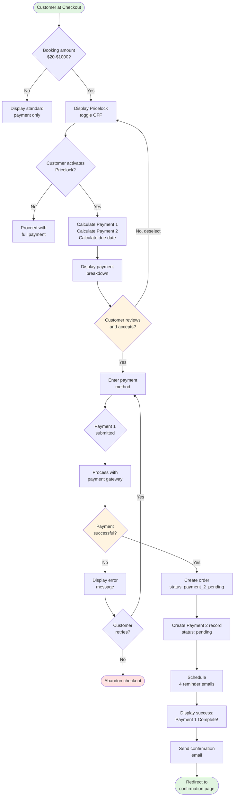

**Key Decision Points:**
1. **Booking amount check:** System determines Pricelock eligibility ([BR-006](#BR-006), [BR-012](#BR-012))
2. **Customer activation:** Customer chooses to use Pricelock (opt-in)
3. **Payment success:** Critical path - payment must succeed for order creation

**System Actions:**
- Real-time calculation of payment split (<100ms, [NFR-001](#NFR-001))
- Atomic transaction: Order creation + Payment 2 record creation
- Reminder job scheduling immediately after Payment 1 success

**Error Handling:**
- Payment failures allow unlimited retries ([FR-035](#FR-035))
- Order preserved on failure; not deleted

<a id="62-personal-cabinet-flow"></a>
### 6.2 Personal Cabinet Flow

**Scope:** Viewing order with pending Payment 2 in Personal Cabinet.  
**Requirements:** [FR-006](#FR-006), [FR-022](#FR-022), [FR-023](#FR-023), [FR-024](#FR-024)

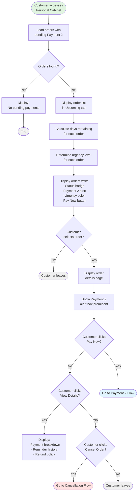

**Key Decision Points:**
1. **Orders with pending Payment 2:** System filters for relevant orders only
2. **Customer action:** Multiple options (pay, view details, cancel)

**Urgency Levels ([FR-024](#FR-024)):**
- Green: >7 days remaining
- Yellow: 3-7 days remaining
- Orange: 1-2 days remaining
- Red: <1 day or overdue

**System Behavior:**
- Real-time countdown display
- Color coding updates daily
- "Pay Now" button always visible (except after full payment)

<a id="63-payment-2-flow"></a>
### 6.3 Payment 2 Flow

**Scope:** Customer paying Payment 2 (early, on-time, or during grace period).  
**Requirements:** [FR-005](#FR-005), [FR-025](#FR-025), [FR-026](#FR-026), [FR-017](#FR-017), [FR-016](#FR-016)

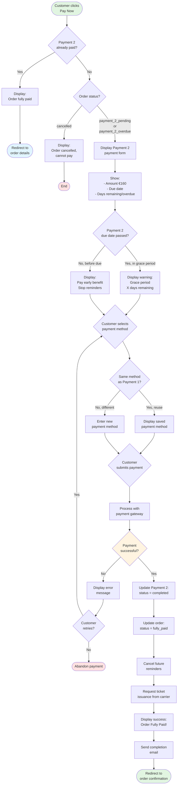

**Key Decision Points:**
1. **Payment 2 status check:** Prevents double payment
2. **Order status check:** Ensures order not cancelled
3. **Grace period detection:** Shows urgency warning if overdue
4. **Payment method selection:** Can reuse Payment 1 method or choose different

**Critical System Actions:**
- Mark Payment 2 complete
- Change order status to 'fully_paid'
- Cancel all future reminder jobs ([FR-033](#FR-033), [BR-017](#BR-017))
- **Request ticket issuance** - Only after Payment 2 complete ([A6](#A6) CRITICAL)

**Payment Methods:**
- Customer can use different card/method than Payment 1 ([BR-009](#BR-009))
- All standard payment methods supported (Card, Google Pay, Apple Pay)

<a id="64-cancellation-flow"></a>
### 6.4 Cancellation Flow

**Scope:** User-initiated or auto-cancellation with partial refund.  
**Requirements:** [FR-014](#FR-014), [FR-012](#FR-012), [FR-013](#FR-013), [FR-015](#FR-015)

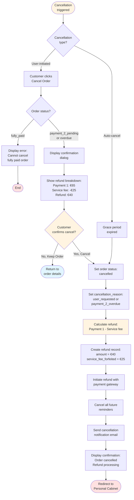

**Key Decision Points:**
1. **Cancellation type:** User-initiated vs system auto-cancel
2. **Order status:** Cannot cancel fully paid orders ([BR-016](#BR-016))
3. **Customer confirmation:** Prevents accidental cancellations

**Refund Calculation ([BR-007](#BR-007), [BR-008](#BR-008)):**
```
Payment_1 = $13
Service_Fee = $5 (NON-REFUNDABLE per A5 CRITICAL assumption)
Refund = Payment_1 - Service_Fee = $13 - $5 = $8
```

**System Actions:**
- Update order status to 'cancelled'
- Record cancellation reason (user_requested or payment_2_overdue)
- Calculate and initiate refund with gateway
- Cancel all future reminder jobs
- Send cancellation notification with refund breakdown

**Refund Timeline:**
- Refund initiated immediately upon cancellation
- Gateway processes in 5-10 business days
- Customer notified of expected refund date

---

<a id="7-use-cases"></a>
## 7. USE CASES

<a id="71-use-case-index"></a>
### 7.1 Use Case Index

| ID | Use Case Name | Priority | Actors | Requirements |
|----|---------------|----------|--------|--------------|
| [UC-001](#UC-001) | Select Pricelock Payment Option | CRITICAL | Customer, System | [FR-001](#FR-001), [FR-018](#FR-018), [FR-019](#FR-019) |
| [UC-002](#UC-002) | Complete Payment 1 with Pricelock | CRITICAL | Customer, System, Payment Gateway | [FR-002](#FR-002), [FR-003](#FR-003), [FR-031](#FR-031) |
| [UC-003](#UC-003) | View Pending Payment 2 in Cabinet | CRITICAL | Customer, System | [FR-006](#FR-006), [FR-022](#FR-022), [FR-023](#FR-023) |
| [UC-004](#UC-004) | Pay Payment 2 Early | HIGH | Customer, System, Payment Gateway | [FR-005](#FR-005), [FR-025](#FR-025), [FR-026](#FR-026) |
| [UC-005](#UC-005) | Pay Payment 2 On Due Date | HIGH | Customer, System | [FR-028](#FR-028), [UC-004](#UC-004) |
| [UC-006](#UC-006) | Receive Payment Reminders | HIGH | System, Email Service, Customer | [FR-027](#FR-027), [FR-028](#FR-028) |
| [UC-007](#UC-007) | Handle Grace Period Payment | CRITICAL | System, Customer | [FR-010](#FR-010), [FR-011](#FR-011), [FR-029](#FR-029) |
| [UC-008](#UC-008) | Process Auto-Cancellation | CRITICAL | System | [FR-012](#FR-012), [FR-013](#FR-013), [FR-030](#FR-030) |
| [UC-009](#UC-009) | Cancel Order Before Payment 2 | HIGH | Customer, System | [FR-014](#FR-014), [FR-015](#FR-015), [FR-036](#FR-036) |
| [UC-010](#UC-010) | Handle Payment Failures | HIGH | Customer, System, Payment Gateway | [FR-034](#FR-034), [FR-035](#FR-035) |

<a id="72-detailed-use-cases"></a>
### 7.2 Detailed Use Cases

<a id="UC-001"></a>
#### UC-001: Select Pricelock Payment Option

**Priority:** CRITICAL  
**Actors:** Customer (primary), System  
**Description:** Customer views and activates Pricelock split payment option at checkout.

**Preconditions:**
- Customer has selected train journey and passenger details
- Customer is at final checkout step
- Booking total amount is between $20-$1000

**Main Flow:**
1. System displays checkout page with order summary
2. System displays Pricelock toggle in OFF state (default)
3. Customer reads Pricelock description and benefits
4. Customer activates Pricelock toggle
5. System calculates Payment 1 amount = Service fee + (Ticket × 0.20) per [BR-001](#BR-001)
6. System calculates Payment 2 amount = Ticket × 0.80 per [BR-002](#BR-002)
7. System calculates Payment 2 due date = Departure - 14 days per [BR-004](#BR-004)
8. System displays payment breakdown with amounts and due date
9. Customer reviews breakdown and proceeds to payment
10. System displays payment method selection

**Postconditions:**
- Pricelock option selected
- Payment breakdown displayed
- Customer ready to enter payment details

**Alternative Flows:**
- **3a. Customer deselects toggle:** System hides breakdown, returns to full payment
- **4a. Customer clicks "Show Details":** System expands accordion with full breakdown explanation

**Exception Flows:**
- **E1. Calculation error:** System displays error, logs issue, defaults to full payment
- **E2. Amount below $20:** Pricelock toggle not displayed per [BR-006](#BR-006)
- **E3. Amount above $1000:** Pricelock toggle not displayed per [BR-012](#BR-012)

**Business Rules Applied:**
- [BR-001](#BR-001): Payment 1 calculation formula
- [BR-002](#BR-002): Payment 2 calculation formula
- [BR-003](#BR-003): Total amount verification
- [BR-004](#BR-004): Due date calculation
- [BR-006](#BR-006): Minimum booking amount
- [BR-012](#BR-012): Maximum booking amount

**Requirements Covered:** [FR-001](#FR-001), [FR-018](#FR-018), [FR-019](#FR-019)  
**Acceptance Criteria:** [AC-001](#AC-001), [AC-002](#AC-002)

---

<a id="UC-002"></a>
#### UC-002: Complete Payment 1 with Pricelock

**Priority:** CRITICAL  
**Actors:** Customer (primary), System, Payment Gateway  
**Description:** Customer completes Payment 1, system creates order and Payment 2 record.

**Preconditions:**
- Pricelock option selected
- Payment breakdown displayed
- Customer has entered valid payment method

**Main Flow:**
1. Customer clicks "Complete Payment" button
2. System validates payment details
3. System creates payment intent with gateway (Payment 1 amount)
4. Payment gateway processes payment
5. Gateway returns success response with payment_intent_id
6. System begins database transaction (atomic)
7. System creates order record with status 'payment_2_pending'
8. System creates Payment 2 record with status 'pending', due_date calculated
9. System marks Payment 1 as 'completed' with timestamp
10. System schedules 4 reminder emails (T-7, T-3, T-1, T-0)
11. System commits transaction
12. System sends confirmation email within 5 minutes
13. System displays success message: "Payment 1 Complete!"
14. Customer redirected to confirmation page

**Postconditions:**
- Order created with status 'payment_2_pending'
- Payment 1 marked complete
- Payment 2 record created with 'pending' status
- Currency locked to Payment 1 currency per [A8](#A8)
- 4 reminder jobs scheduled
- Confirmation email sent
- **Tickets NOT issued** (awaiting Payment 2 per [A6](#A6))

**Alternative Flows:**
- **4a. Payment processing state:** System displays "Processing..." message, polls gateway every 5 seconds

**Exception Flows:**
- **E1. Payment failed:**
  - System displays user-friendly error message per [IR-009](#IR-009)
  - System keeps order in 'pending_payment_1' status
  - System displays "Try Again" button
  - Customer can retry with same or different payment method
  
- **E2. Gateway timeout:**
  - System continues polling up to 5 minutes per [NFR-003](#NFR-003)
  - System displays "Payment processing..." message
  - System eventually times out, displays retry option
  
- **E3. Database transaction failure:**
  - System rolls back entire transaction
  - No order created
  - Customer not charged
  - System logs error, displays generic error message
  
- **E4. Email service unavailable:**
  - Order still created successfully
  - Email queued for retry (3 attempts)
  - Customer can view confirmation in Personal Cabinet
  
- **E5. Customer abandons payment:**
  - Order not created
  - No charge to customer
  - System logs abandonment for analytics

**Business Rules Applied:**
- [BR-001](#BR-001): Payment 1 amount calculation verified
- [BR-010](#BR-010): Currency locked at booking per [A8](#A8)
- [BR-015](#BR-015): Tickets NOT issued until Payment 2 per [A6](#A6)

**Critical Transaction:** Steps 6-11 must be atomic; rollback on any failure

**Requirements Covered:** [FR-002](#FR-002), [FR-003](#FR-003), [FR-004](#FR-004), [FR-031](#FR-031)  
**Acceptance Criteria:** [AC-003](#AC-003), [AC-004](#AC-004), [AC-005](#AC-005), [AC-008](#AC-008)

---

<a id="UC-003"></a>
#### UC-003: View Pending Payment 2 in Personal Cabinet

**Priority:** CRITICAL  
**Actors:** Customer (primary), System  
**Description:** Customer views order with pending Payment 2 in Personal Cabinet.

**Preconditions:**
- Customer logged in
- Order exists with status 'payment_2_pending' or 'payment_2_overdue'
- Payment 1 completed, Payment 2 pending

**Main Flow:**
1. Customer navigates to Personal Cabinet
2. Customer clicks "Upcoming" tab
3. System retrieves orders where Payment 2 status = 'pending'
4. For each order, system calculates days_remaining = due_date - today
5. System determines urgency level based on days_remaining per [FR-024](#FR-024)
6. System displays order list with:
   - Route and departure date
   - Status badge: "Payment Pending"
   - Payment 1: ✓ Completed ($13)
   - Payment 2: ⏳ Pending ($32)
7. Customer clicks on order to view details
8. System displays Payment 2 alert box (prominent) with:
   - "Second Payment Due" heading
   - Amount: $32 (bold)
   - Due date: Sep 4, 2025
   - Countdown: "7 days remaining"
   - Urgency color: Yellow (3-7 days)
   - "Pay Now" button (primary, black)
   - "View Details" button (secondary)

**Postconditions:**
- Customer aware of pending Payment 2
- Clear path to payment ("Pay Now" button visible)

**Alternative Flows:**
- **3a. Multiple orders with pending Payment 2:** System displays all in chronological order by due date (soonest first)
- **8a. Customer clicks "View Details":** System expands to show full payment breakdown, reminder history, refund policy
- **5a. Urgency level Green (>7 days):** Alert box has green left border, "Plenty of time" message
- **5b. Urgency level Orange (1-2 days):** Alert box has orange left border, "Payment due soon" message
- **5c. Urgency level Red (<1 day or overdue):** Alert box has red left border, "URGENT" message

**Exception Flows:**
- **E1. No orders with pending Payment 2:** System displays "No pending payments" message
- **E2. Order status changed (paid elsewhere):** System refreshes list, removes order from pending
- **E3. Database timeout:** System displays error, retry button

**Urgency Color Coding ([FR-024](#FR-024)):**
```
days_remaining = (due_date - today).days

if days_remaining > 7: GREEN
elif days_remaining >= 3: YELLOW
elif days_remaining >= 1: ORANGE
else: RED (overdue or due today)
```

**Requirements Covered:** [FR-006](#FR-006), [FR-022](#FR-022), [FR-023](#FR-023), [FR-024](#FR-024)  
**Acceptance Criteria:** [AC-009](#AC-009), [AC-010](#AC-010)

---

<a id="UC-004"></a>
#### UC-004: Pay Payment 2 Early

**Priority:** HIGH  
**Actors:** Customer (primary), System, Payment Gateway  
**Description:** Customer pays Payment 2 before due date.

**Preconditions:**
- Order exists with status 'payment_2_pending'
- Payment 2 status = 'pending'
- Current date < Payment 2 due date (early payment)
- Customer logged in and viewing order in Personal Cabinet

**Main Flow:**
1. Customer views order in Personal Cabinet (per [UC-003](#UC-003))
2. Customer clicks "Pay Now" button in Payment 2 alert box
3. System validates Payment 2 not already paid
4. System validates order not cancelled
5. System validates early payment allowed (current date < due_date) per [BR-011](#BR-011)
6. System navigates to Payment 2 payment page
7. System displays:
   - Payment 2 amount: $32
   - Due date: Sep 4, 2025
   - Message: "Pay early and avoid reminders!"
   - Days remaining: 7 days
8. System displays payment method selection
9. Customer can choose:
   - Same payment method as Payment 1 (if saved)
   - Different payment method per [BR-009](#BR-009)
10. Customer enters/selects payment details and submits
11. System creates payment intent with gateway (Payment 2 amount)
12. Gateway processes payment
13. Gateway returns success response
14. System marks Payment 2 as 'completed' with timestamp
15. System updates order status to 'fully_paid'
16. System cancels all future reminder jobs per [BR-017](#BR-017) ([FR-033](#FR-033))
17. System requests ticket issuance from carrier per [A6](#A6)
18. System sends completion email: "Payment complete! Tickets on the way"
19. System displays success: "Order Fully Paid!"
20. System displays both payments confirmed (✓ P1, ✓ P2)

**Postconditions:**
- Payment 2 marked 'completed'
- Order status 'fully_paid'
- All future reminders cancelled (T-3, T-1, T-0 will NOT be sent)
- Ticket issuance requested
- Completion email sent

**Alternative Flows:**
- **9a. Customer reuses Payment 1 method:** System displays saved payment method, customer confirms
- **9b. Customer enters different card:** System processes as new payment method

**Exception Flows:**
- **E1. Payment 2 already paid:**
  - System displays "Payment already completed"
  - Redirects to order details showing fully paid status
  
- **E2. Payment failed:**
  - System displays user-friendly error per [IR-009](#IR-009)
  - System keeps Payment 2 status as 'pending'
  - System displays "Try Again" button
  - Customer can retry unlimited times
  
- **E3. Payment processing state:**
  - System displays "Processing..." message
  - System polls gateway for status
  - Updates display when status received
  
- **E4. Ticket issuance API unavailable:**
  - Payment 2 marked complete (customer charged)
  - Order status 'fully_paid'
  - Ticket request queued for retry
  - Support team notified to manual check

**Business Rules Applied:**
- [BR-009](#BR-009): Different payment method allowed
- [BR-011](#BR-011): Early payment explicitly permitted
- [BR-015](#BR-015): Tickets issued after Payment 2 complete per [A6](#A6)
- [BR-017](#BR-017): Reminders cancelled upon payment

**Requirements Covered:** [FR-005](#FR-005), [FR-007](#FR-007), [FR-016](#FR-016), [FR-017](#FR-017), [FR-025](#FR-025), [FR-026](#FR-026), [FR-033](#FR-033)  
**Acceptance Criteria:** [AC-011](#AC-011), [AC-012](#AC-012), [AC-013](#AC-013), [AC-014](#AC-014)

---

<a id="UC-005"></a>
#### UC-005: Pay Payment 2 On Due Date

**Priority:** HIGH  
**Actors:** Customer, System  
**Description:** Customer pays Payment 2 on the due date (last day before overdue).

**Preconditions:**
- Order exists with status 'payment_2_pending'
- Current date = Payment 2 due date (T-0)
- T-0 reminder sent earlier today (09:00 UTC)

**Main Flow:**
- **Identical to [UC-004](#UC-004) except:**
  - Urgency level displayed as CRITICAL (red)
  - Alert message: "Payment due TODAY! Avoid late fees."
  - Countdown shows: "Due today by 11:59 PM"
  - If customer pays successfully before midnight, follows [UC-004](#UC-004) completion flow
  - If customer submits payment after midnight, system redirects to grace period flow (see [UC-007](#UC-007))

**Exception Flow:**
- **E1. Payment submitted after midnight:**
  - Order already changed to 'payment_2_overdue' (00:01 UTC job)
  - Grace period already initiated
  - System displays: "Payment is now overdue but you have 3-day grace period"
  - Proceeds with payment as grace period payment ([UC-007](#UC-007))

**Business Rules Applied:**
- Same as [UC-004](#UC-004)
- T-0 reminder sent same day ([FR-028](#FR-028))
- Critical urgency level ([FR-024](#FR-024))

**Requirements Covered:** [FR-005](#FR-005), [FR-028](#FR-028), [UC-004](#UC-004)  
**Acceptance Criteria:** [AC-015](#AC-015) (urgency level), [AC-012](#AC-012) (payment success)

---

<a id="UC-006"></a>
#### UC-006: Receive Payment Reminders

**Priority:** HIGH  
**Actors:** System (primary), Email Service, Customer  
**Description:** System sends automated reminder emails to customer about Payment 2.

**Preconditions:**
- Order exists with status 'payment_2_pending'
- Payment 2 status = 'pending'
- Reminder job scheduled for today

**Main Flow:**
1. Daily cron job executes at 09:00 UTC
2. System queries all orders with Payment 2 pending
3. For each order, system calculates days_until_due = due_date - today
4. System identifies orders due for reminders today:
   - T-7: days_until_due = 7
   - T-3: days_until_due = 3
   - T-1: days_until_due = 1
   - T-0: days_until_due = 0 (due today)
5. For each reminder to send, system checks reminder_log for duplicate per [BR-018](#BR-018)
6. If no duplicate found today, system proceeds with email
7. System determines email template based on reminder type:
   - T-7: Green, friendly tone, "7 days remaining"
   - T-3: Yellow, moderate urgency, "3 days remaining"
   - T-1: Orange, high urgency, "Payment due tomorrow"
   - T-0: Red, critical urgency, "Payment due TODAY"
8. System prepares email with dynamic data:
   - Order number
   - Amount ($32)
   - Due date
   - "Pay Now" link to Personal Cabinet
9. System sends email via SendGrid API
10. SendGrid returns delivery confirmation
11. System logs reminder in reminder_log table:
   - order_id, reminder_type, sent_at, recipient_email, delivery_status
12. Email delivered to customer inbox

**Postconditions:**
- Reminder email sent
- Delivery logged in reminder_log
- No duplicate reminder sent same day

**Alternative Flows:**
- **6a. Customer paid before reminder:** System detects Payment 2 completed, skips reminder per [BR-017](#BR-017)
- **4a. Multiple orders for same customer:** System sends separate email for each order

**Exception Flows:**
- **E1. Email service unavailable:**
  - SendGrid API returns error
  - System adds reminder to retry queue
  - System retries 3 times (1 hour apart)
  - If still failing, manual notification to support team
  
- **E2. Duplicate check fails:**
  - System finds reminder already sent today
  - System skips email, logs "Duplicate prevented"
  - No email sent to customer
  
- **E3. Database timeout on reminder log write:**
  - Email already sent (cannot recall)
  - System logs error
  - System retries write operation
  - If still failing, reminder sent but not logged (acceptable)

**Reminder Timing:**
- All reminders sent at 09:00 UTC daily
- T-7: 7 days before due date
- T-3: 3 days before due date
- T-1: 1 day before due date
- T-0: On due date

**Email Content Escalation:**
- T-7: Friendly, informational, no pressure
- T-3: Moderate, clear CTA, approaching deadline
- T-1: High urgency, emphasize tomorrow deadline
- T-0: Critical, "due today", avoid late fees message

**Business Rules Applied:**
- [BR-017](#BR-017): Stop reminders when Payment 2 paid
- [BR-018](#BR-018): No duplicate reminders same day (idempotency)

**Requirements Covered:** [FR-027](#FR-027), [FR-028](#FR-028), [IR-003](#IR-003)  
**Acceptance Criteria:** [AC-016](#AC-016), [AC-017](#AC-017), [AC-018](#AC-018), [AC-019](#AC-019)

---

<a id="UC-007"></a>
#### UC-007: Handle Grace Period Payment

**Priority:** CRITICAL  
**Actors:** System (primary), Customer  
**Description:** Customer pays Payment 2 during grace period (after due date but before auto-cancel).

**Preconditions:**
- Order status = 'payment_2_overdue'
- Grace period active (within 3 days of due date)
- Payment 2 still 'pending'
- Customer received URGENT reminder emails

**Main Flow:**
1. Daily overdue check job (00:01 UTC) detected due date passed yesterday
2. System initiated grace period:
   - Set grace_period_start = today 00:01 UTC
   - Set grace_period_end = today + 3 days 00:01 UTC
   - Changed order status to 'payment_2_overdue'
3. System sent first URGENT reminder (grace_day_1) at 09:00 UTC
4. Customer receives URGENT email with:
   - Subject: "URGENT: Payment overdue - 3 days remaining"
   - Warning: "Order will be auto-cancelled in 3 days"
   - Refund policy explained: Service fee forfeited, ticket refunded
   - Large red "Pay Now" button
5. Customer clicks "Pay Now" link in email or accesses Personal Cabinet
6. System displays Payment 2 payment page with RED urgency
7. System shows:
   - "URGENT: Payment Overdue"
   - Amount: $32
   - Grace period: 2 days remaining (day 1 already passed)
   - Warning: Auto-cancel if not paid by [grace_period_end]
8. Customer enters payment details and submits
9. Payment gateway processes payment successfully
10. System marks Payment 2 as 'completed'
11. System updates order status to 'fully_paid'
12. System cancels future grace reminders (day 2 and day 3 not sent)
13. System cancels auto-cancellation job
14. System requests ticket issuance
15. System sends completion email: "Payment received! Order confirmed"
16. Order recovered from overdue status

**Postconditions:**
- Payment 2 completed
- Order status 'fully_paid'
- Grace period ended successfully
- Future grace reminders cancelled
- Auto-cancellation prevented
- Tickets requested

**Alternative Flows:**
- **3a. Grace period Day 2:**
  - If not paid by Day 2, system sends second URGENT reminder: "2 days remaining"
  - Warning more severe: "Final 48 hours"
  
- **3b. Grace period Day 3:**
  - If still not paid by Day 3, system sends FINAL WARNING: "Last day to save your order"
  - "Auto-cancellation tomorrow at midnight"

**Exception Flows:**
- **E1. Payment fails during grace:**
  - System keeps order as 'payment_2_overdue'
  - Grace period continues counting
  - Customer can retry unlimited times
  - If grace expires before successful payment → [UC-008](#UC-008) auto-cancel
  
- **E2. Grace period expires before payment submitted:**
  - System already ran auto-cancel job
  - Order status = 'cancelled'
  - Payment page displays: "Order has been cancelled"
  - Customer cannot pay (order locked)
  - Refund already processed

**Grace Period Daily Reminders ([BR-019](#BR-019)):**
- Day 1 (09:00 UTC): "URGENT - 3 days remaining"
- Day 2 (09:00 UTC): "URGENT - 2 days remaining"
- Day 3 (09:00 UTC): "FINAL WARNING - Last day"

**Business Rules Applied:**
- [A4](#A4): Grace period = 3 days (CRITICAL assumption)
- [BR-013](#BR-013): Grace period duration enforced
- [BR-019](#BR-019): Daily URGENT reminders during grace
- [BR-017](#BR-017): Reminders cancelled upon payment

**Requirements Covered:** [FR-010](#FR-010), [FR-011](#FR-011), [FR-029](#FR-029), [BR-017](#BR-017)  
**Acceptance Criteria:** [AC-020](#AC-020), [AC-021](#AC-021), [AC-022](#AC-022)

---

<a id="UC-008"></a>
#### UC-008: Process Auto-Cancellation

**Priority:** CRITICAL  
**Actors:** System (primary)  
**Description:** System automatically cancels order and processes partial refund after grace period expires.

**Preconditions:**
- Order status = 'payment_2_overdue'
- Grace period ended (grace_period_end < today)
- Payment 2 still 'pending' (customer did not pay during grace)
- All 7 reminders sent (T-7, T-3, T-1, T-0, grace_day_1, grace_day_2, grace_day_3)

**Main Flow:**
1. Daily auto-cancel job executes at 00:01 UTC
2. System queries orders where:
   - status = 'payment_2_overdue'
   - grace_period_end < now()
   - payment_2.status = 'pending'
3. For each expired order, system begins transaction:
4. System updates order status to 'cancelled'
5. System sets cancellation_reason = 'payment_2_overdue'
6. System marks Payment 2 status as 'cancelled'
7. System calculates refund:
   - Payment 1 amount: $13
   - Service fee (non-refundable per [A5](#A5)): $5
   - Refund amount: $13 - $5 = $8
8. System creates refund record:
   - amount = $8
   - service_fee_forfeited = $5
   - reason = 'auto_cancel_overdue'
   - status = 'pending'
9. System initiates refund with payment gateway (refund $8 to original payment method)
10. Gateway confirms refund initiated (processes in 5-10 days)
11. System commits transaction
12. System sends cancellation notification email:
   - Subject: "Order cancelled - Refund processing"
   - Explanation: Grace period expired, payment not received
   - Refund breakdown clearly shown:
     - Payment 1: $13
     - Service fee (forfeited): -$5
     - Your refund: $8
   - Expected refund date: 5-10 business days
   - Apology and invitation to rebook
13. Customer receives email
14. Refund processes over next 5-10 days
15. Customer sees cancelled order in Personal Cabinet

**Postconditions:**
- Order status 'cancelled'
- Cancellation reason recorded: 'payment_2_overdue'
- Service fee forfeited: $5 (NON-REFUNDABLE per [A5](#A5) CRITICAL)
- Refund initiated: $8 (ticket portion)
- Customer notified
- Order permanently cancelled (cannot be reactivated)

**Exception Flows:**
- **E1. Refund API failure:**
  - System logs error
  - Refund record status = 'failed'
  - System adds to manual review queue
  - Support team processes refund manually
  - Customer support notified
  
- **E2. Email service unavailable:**
  - Order still cancelled (process completed)
  - Email queued for retry
  - Customer can see cancelled status in Personal Cabinet
  
- **E3. Database transaction failure:**
  - Entire transaction rolls back
  - Order remains 'payment_2_overdue'
  - Job retries next day (00:01 UTC)

**Refund Calculation ([BR-007](#BR-007), [BR-008](#BR-008)):**
```
Payment_1_Amount = $13
Service_Fee = $5 (FORFEITED - covers admin costs)
Ticket_Deposit = $8

Refund_To_Customer = Payment_1_Amount - Service_Fee
Refund_To_Customer = $13 - $5 = $8
```

**Critical Business Rules:**
- [A5](#A5): Service fee NON-REFUNDABLE (CRITICAL - requires Legal approval)
- [BR-007](#BR-007): Service fee forfeited on cancellation
- [BR-008](#BR-008): Ticket portion IS refunded
- [BR-014](#BR-014): Auto-cancel timing enforced (3 days after due date)

**Requirements Covered:** [FR-012](#FR-012), [FR-013](#FR-013), [FR-015](#FR-015), [FR-030](#FR-030)  
**Acceptance Criteria:** [AC-023](#AC-023), [AC-024](#AC-024)

---

<a id="UC-009"></a>
#### UC-009: Cancel Order Before Payment 2

**Priority:** HIGH  
**Actors:** Customer (primary), System  
**Description:** Customer initiates cancellation before Payment 2 is completed.

**Preconditions:**
- Order status = 'payment_2_pending' or 'payment_2_overdue'
- Payment 2 not yet paid
- Customer logged in and viewing order in Personal Cabinet

**Main Flow:**
1. Customer views order in Personal Cabinet
2. Customer clicks "Cancel Order" button
3. System validates order can be cancelled:
   - Checks status ≠ 'fully_paid' per [BR-016](#BR-016)
   - Checks status ≠ 'cancelled' already
4. System displays confirmation dialog with:
   - Heading: "Are you sure you want to cancel?"
   - Refund breakdown:
     - Payment 1 (paid): $13
     - Service fee (non-refundable): -$5
     - Ticket deposit: $8
     - Your refund: $8
   - Processing time: 5-10 business days
   - Warning: "Service fee covers administrative costs and is non-refundable"
   - Two buttons: "Cancel Order" (red) and "Keep Order" (gray)
5. Customer reviews refund breakdown
6. Customer clicks "Cancel Order" button to confirm
7. System begins transaction:
8. System updates order status to 'cancelled'
9. System sets cancellation_reason = 'user_requested'
10. System marks Payment 2 status as 'cancelled'
11. System calculates refund (same as auto-cancel): $13 - $5 = $8
12. System creates refund record with reason = 'user_cancellation'
13. System initiates refund with payment gateway
14. System cancels all future reminder jobs
15. System commits transaction
16. System sends cancellation confirmation email with refund details
17. System displays success message: "Order cancelled. Refund processing."
18. Customer redirected to Personal Cabinet (order shows 'cancelled' status)

**Postconditions:**
- Order status 'cancelled'
- Cancellation reason: 'user_requested'
- Refund initiated: $8
- Service fee forfeited: $5
- All future reminders cancelled
- Customer notified

**Alternative Flows:**
- **6a. Customer clicks "Keep Order":**
  - Dialog closes
  - No changes to order
  - Customer returned to order details

**Exception Flows:**
- **E1. Order status = 'fully_paid':**
  - System displays error: "Cannot cancel fully paid order"
  - "Cancel Order" button not visible per [BR-016](#BR-016)
  - If attempted via API: HTTP 403 Forbidden
  
- **E2. Order already cancelled:**
  - System displays: "Order already cancelled"
  - Shows existing refund details
  
- **E3. Refund API failure:**
  - Order still cancelled (customer confirmed)
  - Refund queued for manual processing
  - Support team notified
  - Customer email explains refund will process within 5-10 days

**Refund Policy (Same as Auto-Cancel):**
- Service fee: $5 NON-REFUNDABLE per [A5](#A5)
- Ticket deposit: $8 REFUNDED per [BR-008](#BR-008)
- Total refund: $8
- Processing time: 5-10 business days

**Business Rules Applied:**
- [BR-007](#BR-007): Service fee non-refundable
- [BR-008](#BR-008): Ticket portion refundable
- [BR-016](#BR-016): Cannot cancel after fully paid

**Requirements Covered:** [FR-014](#FR-014), [FR-015](#FR-015), [FR-030](#FR-030), [FR-036](#FR-036)  
**Acceptance Criteria:** [AC-025](#AC-025), [AC-030](#AC-030)

---

<a id="UC-010"></a>
#### UC-010: Handle Payment Failures

**Priority:** HIGH  
**Actors:** Customer, System, Payment Gateway  
**Description:** System handles payment failures gracefully, allows retries, preserves order.

**Preconditions:**
- Customer attempting to pay (Payment 1 or Payment 2)
- Payment submitted to gateway

**Main Flow:**
1. Customer submits payment form
2. System sends payment request to gateway
3. Gateway processes payment
4. Gateway returns failure response with error code
5. System maps error code to user-friendly message per [IR-009](#IR-009):
   - `card_declined` → "Your card was declined. Please try a different card."
   - `insufficient_funds` → "Insufficient funds. Please add funds or try another card."
   - `expired_card` → "Your card has expired. Please use a different card."
   - `processing_error` → "Payment processing error. Please try again."
   - `invalid_card` → "Invalid card details. Please check and try again."
6. System displays error message (user-friendly, actionable)
7. System displays "Try Again" button (prominent)
8. System preserves all form data for convenience
9. System does NOT change order status (keeps as-is)
10. System does NOT delete order (preserved for retry)
11. Customer reviews error message
12. Customer clicks "Try Again"
13. System displays payment form again (data prefilled where appropriate)
14. Customer enters new payment details or corrects error
15. Customer resubmits payment
16. If successful: Proceeds with normal flow ([UC-002](#UC-002) or [UC-004](#UC-004))
17. If failed again: Repeats error handling flow

**Postconditions:**
- Error displayed clearly
- Order preserved (not deleted)
- Customer can retry unlimited times
- Payment status unchanged until success

**Alternative Flows:**
- **12a. Customer tries multiple times:**
  - System allows unlimited retry attempts
  - Each failure displays appropriate error
  - Order never deleted
  
- **17a. Customer abandons after failure:**
  - Order remains in current status
  - Reminders continue (if Payment 2)
  - Customer can return later to retry

**Exception Flows:**
- **E1. Gateway timeout (no response):**
  - System waits up to 30 seconds
  - If no response, displays: "Payment processing is taking longer than expected"
  - System polls gateway for webhook (up to 5 minutes)
  - Eventually times out, displays retry option
  - Order preserved
  
- **E2. Fraud detection triggered:**
  - Gateway returns fraud_suspected code
  - System displays: "Payment flagged for review. Please contact support."
  - System logs incident
  - Support team reviews
  - Customer cannot retry until resolved
  
- **E3. Frontend validation error:**
  - Error caught before gateway submission
  - System displays inline validation errors
  - Customer corrects before resubmitting
  - No gateway call made

**Error Message Mapping Examples ([IR-009](#IR-009)):**

| Gateway Error Code | User Message | Action Guidance |
|--------------------|--------------|-----------------|
| card_declined | Your card was declined | Try different card |
| insufficient_funds | Insufficient funds | Add funds or try another card |
| expired_card | Card has expired | Use different card |
| invalid_number | Invalid card number | Check card number |
| invalid_expiry_month | Invalid expiry date | Check expiry MM/YY |
| invalid_cvc | Invalid security code | Check CVV/CVC |
| processing_error | Payment processing error | Try again in a few minutes |

**Business Rules Applied:**
- [FR-035](#FR-035): Unlimited retry attempts allowed
- Order never deleted on payment failure

**Requirements Covered:** [FR-034](#FR-034), [FR-035](#FR-035), [IR-009](#IR-009)  
**Acceptance Criteria:** [AC-006](#AC-006), [AC-026](#AC-026)

---

<a id="8-operational-flows"></a>
## 8. OPERATIONAL FLOWS

This section describes system-level behavior through sequence diagrams showing interactions between components.

<a id="81-payment-1-processing"></a>
### 8.1 Payment 1 Processing

**Description:** Complete flow from Payment 1 submission to order creation.  
**Actors:** User, Frontend, API, Database, Payment Gateway, Email Service  
**Requirements:** [FR-002](#FR-002), [FR-003](#FR-003), [UC-002](#UC-002)

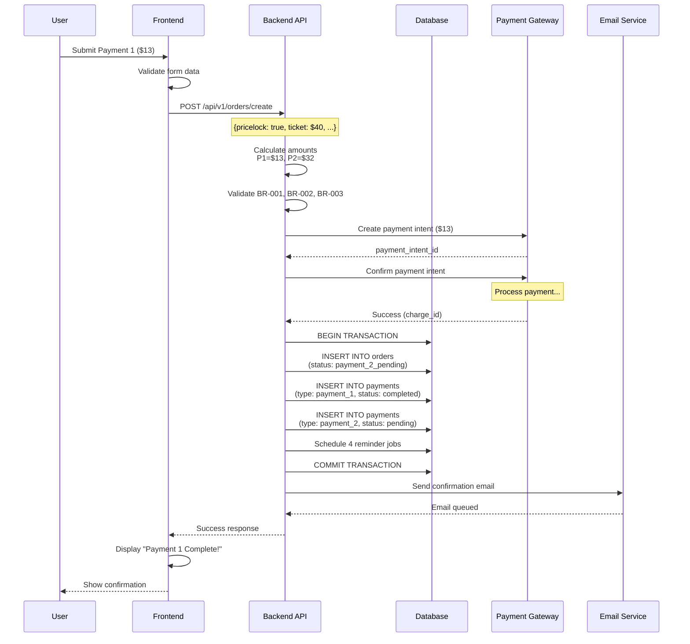

**Key Points:**
- Atomic transaction ensures data consistency
- Payment gateway integration before database writes
- Reminder jobs scheduled immediately
- Email sent asynchronously (doesn't block response)

---

<a id="82-personal-cabinet-view"></a>
### 8.2 Personal Cabinet View

**Description:** User viewing order with pending Payment 2.  
**Actors:** User, Frontend, API, Database  
**Requirements:** [FR-006](#FR-006), [FR-022](#FR-022), [UC-003](#UC-003)

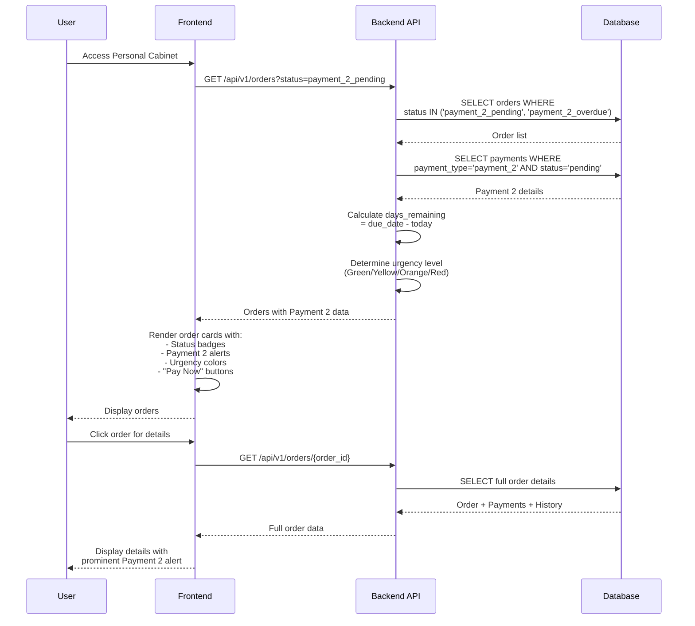

**Key Points:**
- Days remaining calculated server-side (authoritative)
- Urgency level determined by business rules
- Efficient queries (only fetch pending Payment 2 orders)

---

<a id="83-payment-2-processing"></a>
### 8.3 Payment 2 Processing

**Description:** Customer completing Payment 2 (early or during grace).  
**Actors:** User, Frontend, API, Database, Payment Gateway, Ticket System  
**Requirements:** [FR-025](#FR-025), [FR-026](#FR-026), [FR-016](#FR-016), [UC-004](#UC-004)

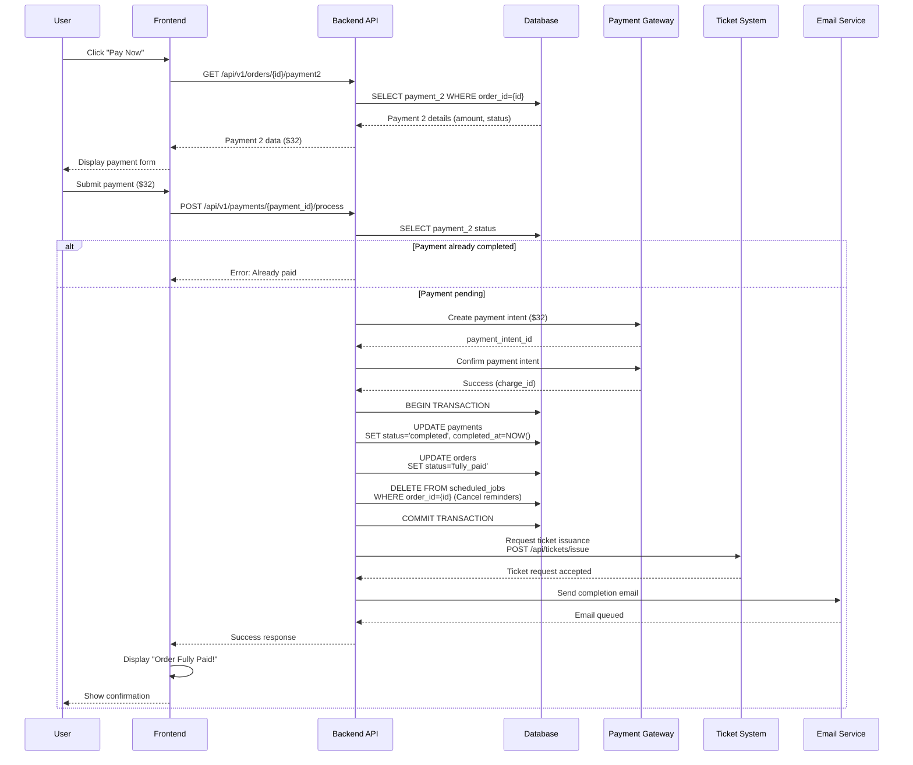

**Key Points:**
- Validates payment not already completed
- Atomic transaction for status updates
- Cancels future reminders ([BR-017](#BR-017))
- Tickets requested ONLY after Payment 2 complete ([A6](#A6) CRITICAL)

---

<a id="84-reminder-system"></a>
### 8.4 Reminder System

**Description:** Automated daily job sending reminder emails.  
**Actors:** Scheduler, API, Database, Email Service  
**Requirements:** [FR-027](#FR-027), [FR-028](#FR-028), [UC-006](#UC-006)

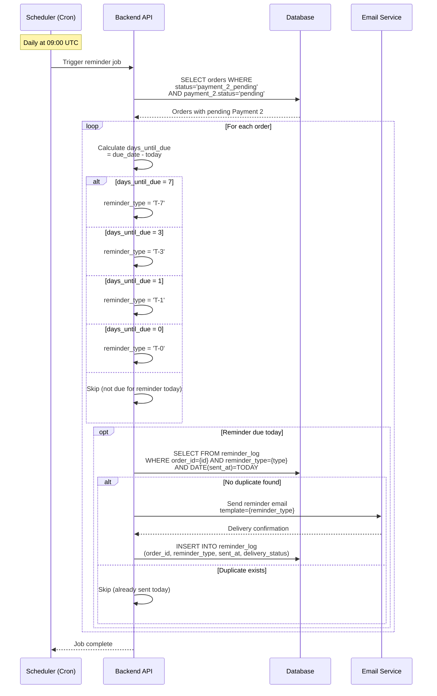

**Key Points:**
- Idempotency check prevents duplicates ([BR-018](#BR-018))
- Template selection based on days remaining
- Logs all sent reminders for audit
- Runs daily at 09:00 UTC

---

<a id="85-grace-period--auto-cancellation"></a>
### 8.5 Grace Period & Auto-Cancellation

**Description:** System detecting overdue, initiating grace period, and auto-cancelling if unpaid.  
**Actors:** Scheduler, API, Database, Payment Gateway, Email Service  
**Requirements:** [FR-010](#FR-010), [FR-011](#FR-011), [FR-012](#FR-012), [UC-007](#UC-007), [UC-008](#UC-008)

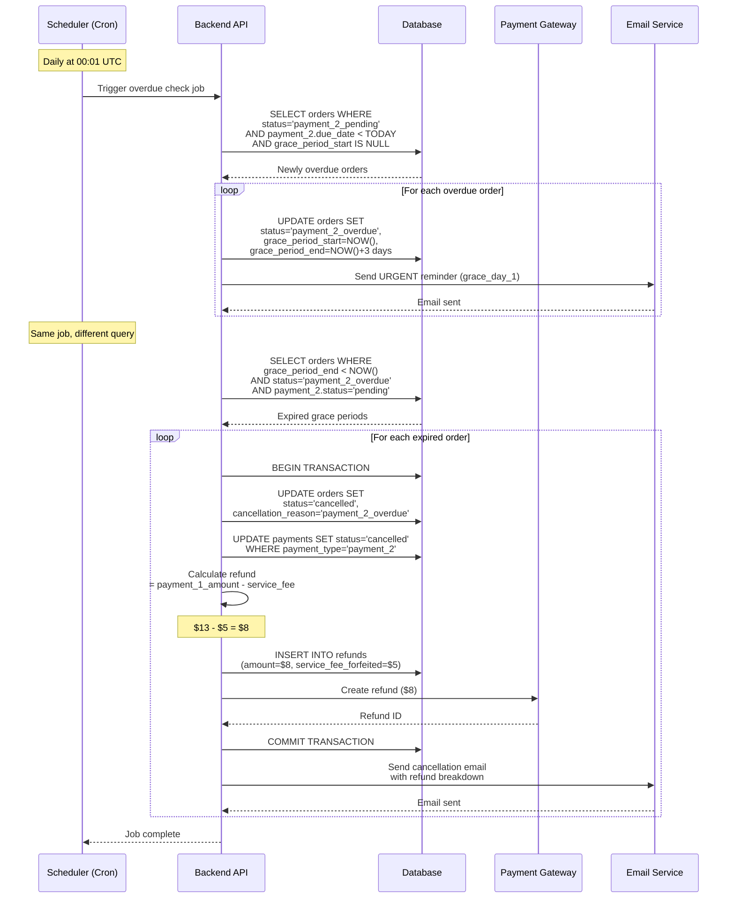

**Key Points:**
- Two-phase job: Detect overdue + Process expired grace
- Grace period = 3 days ([A4](#A4) CRITICAL)
- Service fee forfeited ([A5](#A5) CRITICAL)
- Ticket portion refunded ([BR-008](#BR-008))
- Atomic transaction ensures consistency

---

<a id="86-user-initiated-cancellation"></a>
### 8.6 User-Initiated Cancellation

**Description:** Customer cancels order before Payment 2 complete.  
**Actors:** User, Frontend, API, Database, Payment Gateway, Email Service  
**Requirements:** [FR-014](#FR-014), [FR-015](#FR-015), [UC-009](#UC-009)

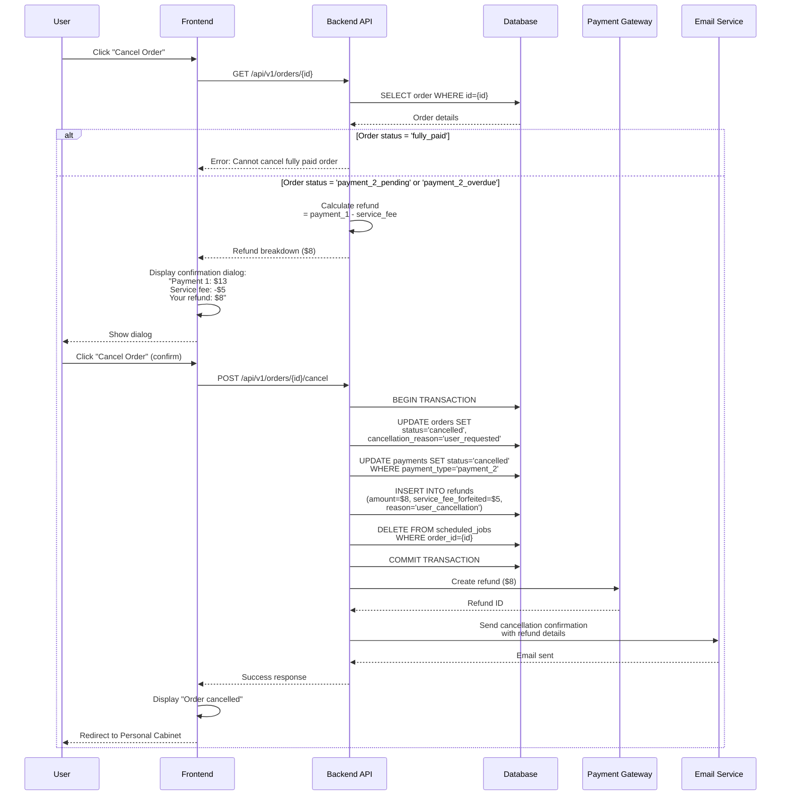

**Key Points:**
- Validates order can be cancelled ([BR-016](#BR-016))
- Same refund logic as auto-cancel
- Confirmation dialog prevents accidental cancellations
- Cancels future reminders
- Atomic transaction

---

<a id="87-error-handling"></a>
### 8.7 Error Handling

**Description:** System handling payment gateway errors and retries.  
**Actors:** User, Frontend, API, Payment Gateway  
**Requirements:** [FR-034](#FR-034), [FR-035](#FR-035), [UC-010](#UC-010)

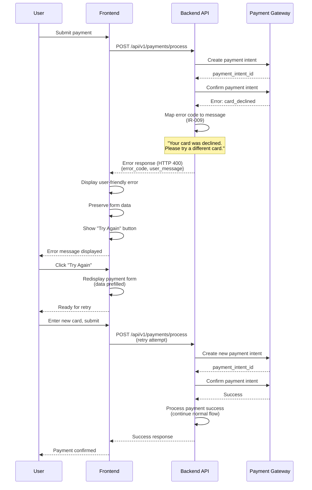

**Key Points:**
- Error mapping to user-friendly messages ([IR-009](#IR-009))
- Order preserved on failure (not deleted)
- Unlimited retry attempts ([FR-035](#FR-035))
- Form data preserved for convenience

---

<a id="9-acceptance-criteria"></a>
## 9. ACCEPTANCE CRITERIA

All acceptance criteria are defined in Given-When-Then format for testability.

<a id="91-checkout--payment-1"></a>
### 9.1 Checkout & Payment 1

<a id="AC-001"></a>
#### AC-001: Pricelock Option Display
**Requirements:** [FR-001](#FR-001), [FR-018](#FR-018)

**Given** customer is at final checkout step with total booking amount of $45  
**When** customer views payment options  
**Then** system displays Pricelock toggle in OFF state by default  
**And** toggle includes description: "Split your payment into two parts"  
**And** toggle includes benefits list (pay less now, flexibility, no extra cost)

---

<a id="AC-002"></a>
#### AC-002: Payment Breakdown Calculation
**Requirements:** [FR-019](#FR-019), [BR-001](#BR-001), [BR-002](#BR-002), [BR-003](#BR-003), [BR-004](#BR-004)

**Given** customer has booking with ticket price $40 and service fee $5  
**When** customer activates Pricelock toggle  
**Then** system calculates Payment 1 = $5 + ($40 × 0.20) = $13  
**And** system calculates Payment 2 = $40 × 0.80 = $32  
**And** system calculates Payment 2 due date = departure_date - 14 days  
**And** system displays breakdown: "Pay $13 now, $32 due [date]"  
**And** total amount ($13 + $32 = $45) equals original booking amount

---

<a id="AC-003"></a>
#### AC-003: Payment 1 Success
**Requirements:** [FR-001](#FR-001), [FR-002](#FR-002), [FR-003](#FR-003)

**Given** customer has selected Pricelock and entered payment details  
**When** customer submits Payment 1 ($13)  
**And** payment gateway confirms success  
**Then** system creates order with status 'payment_2_pending'  
**And** system creates Payment 2 record with amount $32, status 'pending', due_date calculated  
**And** system marks Payment 1 as 'completed'  
**And** system displays confirmation: "Payment 1 Complete! Your booking is confirmed"

---

<a id="AC-004"></a>
#### AC-004: Confirmation Email Sent
**Requirements:** [FR-031](#FR-031)

**Given** Payment 1 has completed successfully  
**When** system confirms order  
**Then** system sends confirmation email within 5 minutes  
**And** email includes order number  
**And** email includes Payment 1 confirmation ($13 received)  
**And** email includes Payment 2 details ($32 due [date])  
**And** email includes link to Personal Cabinet

---

<a id="AC-005"></a>
#### AC-005: Currency Locked at Booking
**Requirements:** [FR-004](#FR-004), [A8](#A8)

**Given** customer books journey with ticket price 40 EUR  
**When** customer completes Payment 1 in EUR  
**Then** system locks currency as EUR  
**And** Payment 2 amount is stored as 32 EUR (same currency)  
**And** Payment 2 cannot be paid in different currency

---

<a id="AC-006"></a>
#### AC-006: Payment 1 Failure Handling
**Requirements:** [FR-034](#FR-034), [FR-035](#FR-035), [IR-009](#IR-009)

**Given** customer has submitted Payment 1  
**When** payment gateway returns decline (insufficient funds)  
**Then** system displays user-friendly error: "Insufficient funds. Please add funds or try a different card."  
**And** system keeps order in 'pending_payment_1' status  
**And** system displays "Try Again" button  
**And** system preserves payment form data  
**And** customer can retry with different payment method

---

<a id="AC-007"></a>
#### AC-007: Payment 1 Processing State
**Requirements:** [FR-008](#FR-008), [NFR-003](#NFR-003)

**Given** customer has submitted Payment 1  
**When** payment is processing (pending gateway confirmation)  
**Then** system displays "Payment processing..." message  
**And** system shows loading indicator  
**And** system polls payment gateway every 5 seconds for status update  
**And** system updates display when status changes (success or failed)

---

<a id="AC-008"></a>
#### AC-008: Reminder Jobs Scheduled
**Requirements:** [FR-027](#FR-027), [FR-028](#FR-028)

**Given** Payment 1 has completed successfully  
**And** Payment 2 due date is September 4, 2025  
**When** system confirms order  
**Then** system schedules T-7 reminder for August 28, 2025 at 09:00 UTC  
**And** system schedules T-3 reminder for September 1, 2025 at 09:00 UTC  
**And** system schedules T-1 reminder for September 3, 2025 at 09:00 UTC  
**And** system schedules T-0 reminder for September 4, 2025 at 09:00 UTC

---

<a id="92-personal-cabinet--payment-2"></a>
### 9.2 Personal Cabinet & Payment 2

<a id="AC-009"></a>
#### AC-009: Order Displayed in Personal Cabinet
**Requirements:** [FR-022](#FR-022), [FR-023](#FR-023)

**Given** customer has completed Payment 1  
**When** customer accesses Personal Cabinet  
**Then** system displays order in "Upcoming" tab  
**And** order shows status badge "Payment Pending"  
**And** order shows route (Krakow → Warsaw)  
**And** order shows departure date  
**And** order shows Payment 1 status: ✓ Completed ($13)  
**And** order shows Payment 2 status: ⏳ Pending ($32)

---

<a id="AC-010"></a>
#### AC-010: Payment 2 Alert Box Display
**Requirements:** [FR-023](#FR-023), [FR-024](#FR-024)

**Given** customer views order with pending Payment 2  
**And** Payment 2 due date is 7 days away  
**When** customer views order details  
**Then** system displays Payment 2 alert box  
**And** alert shows "Second Payment Due"  
**And** alert shows amount: $32  
**And** alert shows due date: September 4, 2025  
**And** alert shows countdown: "7 days remaining"  
**And** alert shows "Pay Now" button (prominent, black)  
**And** alert shows "View Details" button (secondary)

---

<a id="AC-011"></a>
#### AC-011: Early Payment Allowed
**Requirements:** [FR-005](#FR-005), [FR-006](#FR-006), [BR-011](#BR-011)

**Given** customer has order with Payment 2 due in 7 days  
**When** customer clicks "Pay Now" button  
**Then** system navigates to Payment 2 page  
**And** system displays Payment 2 amount ($32)  
**And** system displays message: "Pay early and avoid reminders!"  
**And** system allows customer to proceed with payment  
**And** Payment 2 due date has not passed yet

---

<a id="AC-012"></a>
#### AC-012: Payment 2 Success (Early)
**Requirements:** [FR-025](#FR-025), [FR-026](#FR-026), [FR-017](#FR-017), [FR-033](#FR-033), [BR-017](#BR-017)

**Given** customer pays Payment 2 ($32) before due date  
**When** payment gateway confirms success  
**Then** system marks Payment 2 as 'completed'  
**And** system changes order status to 'fully_paid'  
**And** system cancels all future reminder jobs (T-3, T-1, T-0 not sent)  
**And** system displays success: "Order Fully Paid!"  
**And** system shows both payments confirmed (✓ P1, ✓ P2)

---

<a id="AC-013"></a>
#### AC-013: Ticket Issuance After Payment 2
**Requirements:** [FR-016](#FR-016), [BR-015](#BR-015), [A6](#A6)

**Given** customer has completed Payment 2  
**And** order status is 'fully_paid'  
**When** system confirms full payment  
**Then** system requests ticket issuance from carrier  
**And** tickets are issued within 24 hours  
**And** customer receives email: "Payment complete! Tickets on the way"  
**And** tickets were NOT issued before Payment 2 complete

---

<a id="AC-014"></a>
#### AC-014: Different Payment Method Allowed
**Requirements:** [FR-025](#FR-025), [BR-009](#BR-009)

**Given** customer paid Payment 1 with Card ending 4242  
**When** customer pays Payment 2  
**Then** system allows customer to select different payment method  
**And** customer can use Card ending 5555 (different card)  
**And** customer can use Google Pay (different method)  
**And** system does not require same payment method as Payment 1

---

<a id="AC-015"></a>
#### AC-015: Payment 2 On Due Date
**Requirements:** [FR-028](#FR-028), [FR-024](#FR-024)

**Given** Payment 2 due date is today (September 4, 2025)  
**When** customer accesses Personal Cabinet  
**Then** system displays urgency level as CRITICAL (red)  
**And** alert shows "Payment due TODAY! Avoid late fees."  
**And** countdown shows "Due today by 11:59 PM"  
**And** customer can still pay until 11:59 PM same day

---

<a id="93-reminders"></a>
### 9.3 Reminders

<a id="AC-016"></a>
#### AC-016: T-7 Day Reminder Sent
**Requirements:** [FR-027](#FR-027), [BR-018](#BR-018)

**Given** Payment 2 due date is 7 days from today  
**And** Payment 2 status is 'pending'  
**When** daily reminder job runs at 09:00 UTC  
**Then** system sends T-7 reminder email  
**And** email subject contains "Reminder: Second payment due in 7 days"  
**And** email includes order number, amount ($32), due date  
**And** email includes "Pay Now" link  
**And** email has friendly tone (low urgency, green theme)

---

<a id="AC-017"></a>
#### AC-017: T-3 Day Reminder Sent
**Requirements:** [FR-027](#FR-027)

**Given** Payment 2 due date is 3 days from today  
**And** Payment 2 status is 'pending'  
**And** T-7 reminder was already sent  
**When** daily reminder job runs at 09:00 UTC  
**Then** system sends T-3 reminder email  
**And** email subject contains "Payment due in 3 days"  
**And** email has moderate urgency (yellow theme)  
**And** email includes countdown: "3 days remaining"

---

<a id="AC-018"></a>
#### AC-018: T-0 Reminder Sent (Due Date)
**Requirements:** [FR-028](#FR-028)

**Given** Payment 2 due date is today  
**And** Payment 2 status is 'pending'  
**When** daily reminder job runs at 09:00 UTC  
**Then** system sends T-0 reminder email  
**And** email subject contains "Payment due TODAY"  
**And** email has critical urgency (red theme)  
**And** email includes large "Pay Now" button  
**And** email warns: "Due today by 11:59 PM"

---

<a id="AC-019"></a>
#### AC-019: No Duplicate Reminders Same Day
**Requirements:** [BR-018](#BR-018)

**Given** T-7 reminder was sent today at 09:00 UTC  
**When** daily reminder job runs again at 09:00 UTC same day (system error)  
**Then** system checks reminder_log for today's date  
**And** system finds existing T-7 reminder sent today  
**And** system does NOT send duplicate T-7 reminder  
**And** system logs: "Reminder already sent today, skipping"

---

<a id="94-grace-period--cancellation"></a>
### 9.4 Grace Period & Cancellation

<a id="AC-020"></a>
#### AC-020: Grace Period Initiated
**Requirements:** [FR-010](#FR-010), [FR-011](#FR-011), [BR-013](#BR-013), [A4](#A4)

**Given** Payment 2 due date was yesterday (September 4, 2025)  
**And** Payment 2 status is still 'pending' (not paid)  
**When** daily overdue check job runs at 00:01 UTC today (September 5)  
**Then** system changes order status to 'payment_2_overdue'  
**And** system sets grace_period_start = September 5, 00:01 UTC  
**And** system sets grace_period_end = September 8, 00:01 UTC (3 days later)  
**And** system calculates days_remaining = 3

---

<a id="AC-021"></a>
#### AC-021: Grace Period URGENT Reminder
**Requirements:** [FR-029](#FR-029), [BR-019](#BR-019)

**Given** order status is 'payment_2_overdue'  
**And** grace period started today (Day 1)  
**When** daily reminder job runs at 09:00 UTC  
**Then** system sends URGENT email  
**And** email subject contains "URGENT: Payment overdue - 3 days remaining"  
**And** email has maximum urgency (red theme, warning icon)  
**And** email warns: "Order will be auto-cancelled in 3 days"  
**And** email explains: Service fee forfeited, ticket portion refunded

---

<a id="AC-022"></a>
#### AC-022: Payment During Grace Period
**Requirements:** [FR-011](#FR-011), [BR-017](#BR-017)

**Given** order status is 'payment_2_overdue'  
**And** grace period has 2 days remaining  
**When** customer pays Payment 2 ($32)  
**And** payment gateway confirms success  
**Then** system marks Payment 2 as 'completed'  
**And** system changes order status to 'fully_paid'  
**And** system cancels grace period reminders (Day 2 and Day 3 not sent)  
**And** system cancels auto-cancellation job  
**And** system sends completion email: "Payment received! Order confirmed"

---

<a id="AC-023"></a>
#### AC-023: Auto-Cancellation After Grace Period
**Requirements:** [FR-012](#FR-012), [BR-014](#BR-014)

**Given** order status is 'payment_2_overdue'  
**And** grace period ended yesterday (September 8, 00:01 UTC)  
**And** Payment 2 is still 'pending' (not paid during grace)  
**When** daily auto-cancel job runs at 00:01 UTC today (September 9)  
**Then** system changes order status to 'cancelled'  
**And** system sets cancellation_reason = 'payment_2_overdue'  
**And** system marks Payment 2 as 'cancelled'  
**And** system calculates refund amount = $13 - $5 = $8  
**And** system creates refund record (amount: $8, service_fee_forfeited: $5)

---

<a id="AC-024"></a>
#### AC-024: Refund Calculation on Auto-Cancel
**Requirements:** [FR-013](#FR-013), [FR-015](#FR-015), [BR-007](#BR-007), [BR-008](#BR-008), [A5](#A5)

**Given** order has been auto-cancelled  
**And** Payment 1 was $13 (service fee $5 + ticket deposit $8)  
**When** system processes refund  
**Then** system refunds ticket portion only: $8  
**And** system forfeits service fee: $5 (NON-REFUNDABLE)  
**And** system initiates refund with payment gateway ($8 to original payment method)  
**And** refund processes in 5-10 business days  
**And** customer receives cancellation email with refund breakdown

---

<a id="AC-025"></a>
#### AC-025: User-Initiated Cancellation
**Requirements:** [FR-014](#FR-014), [FR-015](#FR-015), [FR-036](#FR-036)

**Given** customer has order with Payment 2 pending  
**When** customer clicks "Cancel Order" button in Personal Cabinet  
**Then** system displays confirmation dialog  
**And** dialog shows refund breakdown:
  - Service fee: $5 (non-refundable, forfeited)
  - Ticket deposit: $8 (will be refunded)
  - Total refund: $8  
**And** dialog shows processing time: 5-10 business days  
**And** dialog has "Cancel Order" button (red) and "Keep Order" button (gray)  
**When** customer confirms "Cancel Order"  
**Then** system changes order status to 'cancelled'  
**And** system sets cancellation_reason = 'user_requested'  
**And** system processes refund ($8) same as auto-cancellation

---

<a id="95-edge-cases"></a>
### 9.5 Edge Cases

<a id="AC-026"></a>
#### AC-026: Payment 2 Failure Handling
**Requirements:** [FR-034](#FR-034), [FR-035](#FR-035), [IR-009](#IR-009)

**Given** customer attempts to pay Payment 2 ($32)  
**When** payment gateway returns decline (card declined)  
**Then** system keeps Payment 2 status as 'pending'  
**And** system does NOT change order status  
**And** system displays error: "Your card was declined. Please try a different card."  
**And** system shows "Try Again" button  
**And** customer can retry unlimited times  
**And** reminders continue (payment still pending)

---

<a id="AC-027"></a>
#### AC-027: Payment Gateway Timeout
**Requirements:** [NFR-004](#NFR-004), [BR-020](#BR-020)

**Given** customer has submitted Payment 2  
**When** payment gateway does not respond within 30 seconds  
**Then** system displays: "Payment processing is taking longer than expected. Please wait..."  
**And** system continues polling for webhook (up to 5 minutes)  
**And** system shows "Check Status" button  
**And** customer can click "Check Status" to manually refresh  
**And** order is NOT deleted (preserved for delayed webhook)

---

<a id="AC-028"></a>
#### AC-028: Pricelock Not Available Below $20
**Requirements:** [BR-006](#BR-006), [A8](#A8)

**Given** customer has booking with total amount $18  
**When** customer reaches final checkout step  
**Then** system does NOT display Pricelock toggle  
**And** system shows standard payment only  
**And** system logs: "Pricelock not available for booking below $20"

---

<a id="AC-029"></a>
#### AC-029: Pricelock Not Available Above $1000
**Requirements:** [BR-012](#BR-012), [A8](#A8)

**Given** customer has booking with total amount $1200  
**When** customer reaches final checkout step  
**Then** system does NOT display Pricelock toggle  
**And** system shows standard payment only  
**And** system logs: "Pricelock not available for booking above $1000"

---

<a id="AC-030"></a>
#### AC-030: Cannot Cancel After Payment 2 Complete
**Requirements:** [FR-014](#FR-014), [BR-016](#BR-016)

**Given** customer has order with status 'fully_paid'  
**And** both Payment 1 and Payment 2 are 'completed'  
**When** customer views order in Personal Cabinet  
**Then** "Cancel Order" button is NOT visible  
**And** order shows "Fully Paid" badge  
**When** customer attempts API call to cancel (direct endpoint access)  
**Then** system returns error: HTTP 403 Forbidden  
**And** error message: "Cannot cancel fully paid order"

---

<a id="10-test-strategy"></a>
## 10. TEST STRATEGY

<a id="101-test-approach"></a>
### 10.1 Test Approach

Testing for Pricelock feature follows a multi-level strategy ensuring comprehensive coverage across functional, non-functional, and integration requirements.

**Testing Philosophy:**
- Risk-based: Critical paths (payment, refunds) tested exhaustively
- Automation-first: Regression suite automated for CI/CD
- Shift-left: Early testing during development
- Continuous: Automated tests run on every commit

**Test Environments:**
- **Dev:** Developer local testing
- **QA:** Functional and integration testing
- **Staging:** End-to-end and performance testing
- **Production:** Smoke tests only (limited scope)

<a id="102-test-levels"></a>
### 10.2 Test Levels

#### 10.2.1 Unit Tests (25 tests)

**Scope:** Individual functions, calculations, validations

**Key Tests:**
- Payment split calculations ([BR-001](#BR-001), [BR-002](#BR-002), [BR-003](#BR-003))
- Due date calculations ([BR-004](#BR-004))
- Refund calculations ([BR-007](#BR-007), [BR-008](#BR-008))
- Grace period day calculations
- Currency validation
- Amount range validations (min/max)

**Tools:** Jest (Frontend), PyTest (Backend)  
**Coverage Target:** 80%+ code coverage  
**Execution Time:** ~2 hours  
**Pass Criteria:** 100% pass rate

#### 10.2.2 Integration Tests (6 tests)

**Scope:** Component interactions, API endpoints, database operations

**Key Tests:**
- Order creation with Pricelock ([FR-002](#FR-002))
- Payment gateway webhook handling ([IR-002](#IR-002))
- Email delivery ([IR-003](#IR-003))
- Reminder scheduling ([FR-027](#FR-027))
- Grace period initiation ([FR-010](#FR-010))
- Auto-cancellation processing ([FR-012](#FR-012))

**Tools:** Postman/Newman, Database fixtures  
**Environment:** QA  
**Execution Time:** ~4 hours  
**Pass Criteria:** 100% pass rate

#### 10.2.3 End-to-End Tests (4 tests)

**Scope:** Complete user journeys from UI to database

**Key Tests:**
- **E2E-001:** Complete Pricelock journey (Happy Path) - 40 steps
  - Checkout → Payment 1 → Cabinet → Payment 2 → Tickets
- **E2E-002:** Grace period and recovery
- **E2E-003:** Auto-cancellation path
- **E2E-004:** User-initiated cancellation

**Tools:** Cypress (automated), Manual exploratory  
**Environment:** Staging  
**Execution Time:** ~2 hours  
**Pass Criteria:** 100% pass rate

#### 10.2.4 Non-Functional Tests (10 tests)

**Performance Tests (4 tests):**
- Frontend calculation performance (<100ms per [NFR-001](#NFR-001))
- API response time (<2s per [NFR-002](#NFR-002))
- Load test (100 concurrent users)
- Database query performance (<1s)

**Security Tests (4 tests):**
- PCI compliance verification - NO card storage ([NFR-005](#NFR-005)) **CRITICAL**
- SQL injection prevention
- API rate limiting (100 req/min)
- Webhook signature verification

**Usability Tests (2 studies):**
- Pricelock benefits clarity (80%+ understanding)
- Error message helpfulness ([IR-009](#IR-009))

**Tools:** Locust (load), OWASP ZAP (security), User testing platform  
**Pass Criteria:** 95%+ within SLA

<a id="103-test-cases-summary"></a>
### 10.3 Test Cases Summary

Complete test specifications are maintained in separate document: **Test_Cases_Pricelock.md**

**Test Case Categories:**

| Category | Count | Priority | Coverage |
|----------|-------|----------|----------|
| Unit Tests | 25 | HIGH | Calculations, validations |
| Integration Tests | 6 | CRITICAL | API, database, gateway |
| End-to-End Tests | 4 | CRITICAL | Complete journeys |
| Negative Tests | 7 | HIGH | Error handling, edge cases |
| Performance Tests | 4 | MEDIUM | NFR compliance |
| Security Tests | 4 | CRITICAL | PCI, injection, auth |
| Usability Tests | 2 | MEDIUM | UX validation |
| Accessibility Tests | 2 | MEDIUM | WCAG compliance |

**Total Test Cases:** 54  
**Estimated Execution Time:** 26 hours (3.25 days)

**Critical Test Focus:**
1. **Payment split accuracy** ([BR-001](#BR-001), [BR-002](#BR-002), [BR-003](#BR-003))
2. **Refund calculation** ([BR-007](#BR-007), [BR-008](#BR-008), [A5](#A5))
3. **PCI compliance** ([NFR-005](#NFR-005)) - Zero card data stored
4. **Grace period logic** ([A4](#A4), [BR-013](#BR-013), [BR-014](#BR-014))
5. **Ticket issuance timing** ([A6](#A6) - Only after Payment 2)

**Test Execution Plan:**
- **Day 1:** Unit tests (100% pass, 80%+ code coverage)
- **Day 2:** Integration tests (QA environment)
- **Day 3:** E2E tests (automated + exploratory)
- **Day 4:** Non-functional tests (performance, security)
- **Day 5:** Regression, final sign-off

**Test Completion Criteria:**
- ✅ All CRITICAL tests pass (100%)
- ✅ All HIGH tests pass (95%+)
- ✅ No P0 (blocking) defects
- ✅ Performance within SLA
- ✅ Security tests pass (100%)
- ✅ PCI compliance verified
- ✅ User acceptance complete
- ✅ Production monitoring configured
- ✅ Rollback plan documented

**Defect Priorities:**
- **P0 (Critical):** Production blocking, data loss, security breach, payment failures
- **P1 (High):** Major feature broken, incorrect calculations, poor UX
- **P2 (Medium):** Minor issues, workarounds available
- **P3 (Low):** Cosmetic, nice-to-have

**Reference:** See **[Test_Cases_Pricelock.md](Test_Cases_Pricelock.md)** for detailed test procedures, expected results, and test code examples.

---

<a id="11-assumptions--constraints"></a>
## 11. ASSUMPTIONS & CONSTRAINTS

<a id="111-critical-assumptions"></a>
### 11.1 Critical Assumptions

These assumptions are CRITICAL and require stakeholder approval before implementation. Invalid assumptions may block release.

<a id="A1"></a>
#### A1: Payment Split Ratio (20/80)
**Priority:** HIGH  
**Assumption:** Payment 1 = 20% of ticket, Payment 2 = 80% of ticket  
**Rationale:** 20% is meaningful commitment while keeping initial payment low  
**Risk:** MEDIUM - Ratio affects customer appeal vs revenue risk  
**Validation Needed:** Product Manager approval  
**Impact if Invalid:** Recalculate all formulas, update UI, retest  
**Requirements:** [BR-001](#BR-001), [BR-002](#BR-002), [FR-019](#FR-019)

---

<a id="A2"></a>
#### A2: Due Date Timing (14 Days Before Departure)
**Priority:** HIGH  
**Assumption:** Payment 2 due 14 days before departure  
**Rationale:** Provides buffer for ticket issuance; carrier requirements  
**Risk:** MEDIUM - Too short = customer pressure, too long = revenue delay  
**Validation Needed:** Product Manager + Carrier requirements check  
**Impact if Invalid:** Change due date calculation, reschedule reminders  
**Requirements:** [BR-004](#BR-004), [FR-019](#FR-019)

---

<a id="A3"></a>
#### A3: Service Fee Amount ($5 USD)
**Priority:** MEDIUM  
**Assumption:** Fixed service fee of $5 USD across all bookings  
**Rationale:** Covers administrative overhead (reminders, processing, grace period)  
**Risk:** LOW - Standard fee structure in industry  
**Validation Needed:** Finance team approval  
**Impact if Invalid:** Update calculations, UI displays, refund logic  
**Requirements:** [BR-001](#BR-001), [BR-005](#BR-005)

---

<a id="A4"></a>
#### A4: Grace Period Duration (3 Days)
**Priority:** CRITICAL  
**Assumption:** 3-day grace period after Payment 2 due date  
**Rationale:** Balance between customer flexibility and business risk  
**Risk:** HIGH - Affects cancellation rates, customer goodwill  
**Validation Needed:** Product Manager + Legal approval REQUIRED  
**Impact if Invalid:** Change grace period calculation, reminder schedule, auto-cancel timing  
**Requirements:** [FR-011](#FR-011), [BR-013](#BR-013), [BR-014](#BR-014), [UC-007](#UC-007), [UC-008](#UC-008)

---

<a id="A5"></a>
#### A5: Service Fee Non-Refundable (CRITICAL)
**Priority:** CRITICAL  
**Assumption:** Service fee is NOT refunded on cancellation; ticket portion IS refunded  
**Rationale:** Fee covers real costs incurred (reservation, reminders, processing)  
**Risk:** CRITICAL - Affects customer expectations, legal compliance, trust  
**Validation Needed:** Legal team approval REQUIRED, clear customer communication  
**Impact if Invalid:** Complete refund policy redesign, financial model change, legal review  
**Requirements:** [BR-007](#BR-007), [BR-008](#BR-008), [FR-013](#FR-013), [FR-015](#FR-015), [UC-008](#UC-008), [UC-009](#UC-009)  
**Customer Communication:** Must be disclosed at checkout and in terms & conditions

---

<a id="A6"></a>
#### A6: Tickets Issued After Payment 2 (CRITICAL)
**Priority:** CRITICAL  
**Assumption:** Rail tickets are NOT issued until Payment 2 is completed  
**Rationale:** Prevents revenue loss from customers taking tickets without full payment  
**Risk:** CRITICAL - Core business logic, affects carrier relationships  
**Validation Needed:** Carrier approval REQUIRED for each rail partner  
**Impact if Invalid:** Feature may not be viable; requires alternative payment model  
**Requirements:** [FR-016](#FR-016), [BR-015](#BR-015), [UC-002](#UC-002), [UC-004](#UC-004)  
**Carrier Coordination:** Must get written approval from each carrier; policies may vary

---

<a id="A7"></a>
#### A7: Email Reminders Sufficient
**Priority:** MEDIUM  
**Assumption:** Email reminders are sufficient; SMS not required for v1.0  
**Rationale:** Email has high reach; SMS adds cost and complexity  
**Risk:** MEDIUM - Customers may miss email reminders  
**Validation Needed:** Customer research, analytics  
**Impact if Invalid:** May need to add SMS channel (Phase 2)  
**Requirements:** [FR-027](#FR-027), [FR-028](#FR-028), [FR-029](#FR-029)

---

<a id="A8"></a>
#### A8: Currency Locked at Booking (CRITICAL)
**Priority:** CRITICAL  
**Assumption:** Exchange rate locked at booking time; Payment 1 and Payment 2 use same currency  
**Rationale:** Prevents FX risk, customer confusion from amount changes  
**Risk:** CRITICAL - Affects international bookings, financial reporting  
**Validation Needed:** Finance team approval REQUIRED  
**Impact if Invalid:** Need dynamic currency conversion, FX hedging, complex pricing  
**Requirements:** [FR-004](#FR-004), [BR-010](#BR-010), [AC-005](#AC-005)

---

<a id="112-additional-assumptions"></a>
### 11.2 Additional Assumptions

These assumptions have lower risk but should still be validated:

**A9:** Pricelock available for bookings $20-$1000 only (risk management)  
**A10:** Same payment methods for Payment 1 and Payment 2 (consistency)  
**A11:** Single currency per booking (no mixed currency splits)  
**A12:** No interest or finance charges (simple split, not loan)  
**A13:** Customer email address valid and monitored  
**A14:** Payment gateway (Stripe) reliability >99.9% uptime  
**A15:** Email service (SendGrid) delivery rate >95%  
**A16:** Customers have internet access to view Personal Cabinet  
**A17:** Standard ticket cancellation policies apply after full payment

---

<a id="113-constraints"></a>
### 11.3 Constraints

**Technical Constraints:**
1. **Payment Gateway:** Limited to Stripe (current provider); no multi-gateway support v1.0
2. **Email Service:** Limited to SendGrid; no SMS channel v1.0
3. **Database:** PostgreSQL required; no NoSQL support
4. **Browser Support:** Modern browsers only (Chrome, Firefox, Safari, Edge); no IE11
5. **Mobile:** Responsive web design; native mobile app updates required separately

**Business Constraints:**
1. **Scope:** Last checkout step only; no full journey redesign (per PM guidance)
2. **Timeline:** Must launch within 6 weeks of approval
3. **Budget:** No external BNPL integration (Klarna, Affirm); native solution only
4. **Regulatory:** PCI DSS Level 1 compliance mandatory ([NFR-005](#NFR-005))

**Operational Constraints:**
1. **Support:** English language only v1.0; localization in Phase 2
2. **Hours:** Reminder jobs run 09:00 UTC daily; no timezone customization v1.0
3. **Refund SLA:** 5-10 business days (payment gateway limitation)
4. **Grace Period:** Fixed 3 days; no customer-specific extensions

**Data Constraints:**
1. **Retention:** Order data retained minimum 7 years (regulatory)
2. **Privacy:** GDPR compliance for EU customers
3. **Audit:** All payment transactions logged for minimum 1 year

---

<a id="12-traceability-matrix"></a>
## 12. TRACEABILITY MATRIX

<a id="121-requirements-coverage"></a>
### 12.1 Requirements Coverage

**Summary:**

| Requirement Type | Total | Covered by Tests | Coverage % |
|------------------|-------|------------------|------------|
| Functional (FR) | 36 | 32 | 89% |
| Business Rules (BR) | 20 | 18 | 90% |
| Non-Functional (NFR) | 6 | 6 | 100% |
| Data (DR) | 4 | 4 | 100% |
| Integration (IR) | 18 | 15 | 83% |
| **Total** | **84** | **75** | **89%** |

**Requirements to Use Cases:**

| FR | Use Cases | AC |
|----|-----------|-----|
| [FR-001](#FR-001) | [UC-001](#UC-001) | [AC-001](#AC-001), [AC-028](#AC-028), [AC-029](#AC-029) |
| [FR-002](#FR-002) | [UC-002](#UC-002) | [AC-003](#AC-003) |
| [FR-003](#FR-003) | [UC-002](#UC-002) | [AC-003](#AC-003), [AC-004](#AC-004) |
| [FR-004](#FR-004) | [UC-002](#UC-002) | [AC-005](#AC-005) |
| [FR-005](#FR-005) | [UC-004](#UC-004) | [AC-011](#AC-011), [AC-012](#AC-012) |
| [FR-006](#FR-006) | [UC-003](#UC-003) | [AC-009](#AC-009), [AC-010](#AC-010) |
| [FR-010](#FR-010) | [UC-007](#UC-007) | [AC-020](#AC-020) |
| [FR-011](#FR-011) | [UC-007](#UC-007) | [AC-020](#AC-020), [AC-022](#AC-022) |
| [FR-012](#FR-012) | [UC-008](#UC-008) | [AC-023](#AC-023) |
| [FR-013](#FR-013) | [UC-008](#UC-008) | [AC-024](#AC-024) |
| [FR-014](#FR-014) | [UC-009](#UC-009) | [AC-025](#AC-025), [AC-030](#AC-030) |
| [FR-015](#FR-015) | [UC-009](#UC-009) | [AC-025](#AC-025) |
| [FR-016](#FR-016) | [UC-004](#UC-004) | [AC-013](#AC-013) |
| [FR-017](#FR-017) | [UC-004](#UC-004) | [AC-012](#AC-012) |
| [FR-027](#FR-027) | [UC-006](#UC-006) | [AC-016](#AC-016), [AC-017](#AC-017) |
| [FR-028](#FR-028) | [UC-006](#UC-006) | [AC-018](#AC-018) |
| [FR-029](#FR-029) | [UC-007](#UC-007) | [AC-021](#AC-021) |
| [FR-034](#FR-034) | [UC-010](#UC-010) | [AC-006](#AC-006), [AC-026](#AC-026) |
| [FR-035](#FR-035) | [UC-010](#UC-010) | [AC-006](#AC-006), [AC-026](#AC-026) |

<a id="122-assumptions-to-requirements"></a>
### 12.2 Assumptions to Requirements

**Critical Assumptions Mapping:**

| Assumption | Requirements | Business Rules | Use Cases | Priority |
|------------|--------------|----------------|-----------|----------|
| [A1](#A1) (20/80 split) | [FR-019](#FR-019) | [BR-001](#BR-001), [BR-002](#BR-002) | [UC-001](#UC-001) | HIGH |
| [A2](#A2) (14 days) | [FR-019](#FR-019) | [BR-004](#BR-004) | [UC-001](#UC-001) | HIGH |
| [A3](#A3) ($5 fee) | [FR-019](#FR-019) | [BR-005](#BR-005) | [UC-001](#UC-001) | MEDIUM |
| [A4](#A4) (3-day grace) | [FR-010](#FR-010), [FR-011](#FR-011), [FR-012](#FR-012) | [BR-013](#BR-013), [BR-014](#BR-014) | [UC-007](#UC-007), [UC-008](#UC-008) | **CRITICAL** |
| [A5](#A5) (Fee non-refundable) | [FR-013](#FR-013), [FR-015](#FR-015) | [BR-007](#BR-007), [BR-008](#BR-008) | [UC-008](#UC-008), [UC-009](#UC-009) | **CRITICAL** |
| [A6](#A6) (Tickets after P2) | [FR-016](#FR-016) | [BR-015](#BR-015) | [UC-002](#UC-002), [UC-004](#UC-004) | **CRITICAL** |
| [A7](#A7) (Email only) | [FR-027](#FR-027), [FR-028](#FR-028), [FR-029](#FR-029) | - | [UC-006](#UC-006) | MEDIUM |
| [A8](#A8) (Currency locked) | [FR-004](#FR-004) | [BR-010](#BR-010) | [UC-002](#UC-002) | **CRITICAL** |

**Validation Status:**

| Assumption | Validation Required From | Status | Blocker? |
|------------|--------------------------|--------|----------|
| [A1](#A1) | Product Manager | Pending | No |
| [A2](#A2) | Product Manager + Carriers | Pending | No |
| [A3](#A3) | Finance Team | Pending | No |
| [A4](#A4) | Product Manager + Legal | Pending | **YES** |
| [A5](#A5) | Legal Team | Pending | **YES** |
| [A6](#A6) | Rail Carriers (Each) | Pending | **YES** |
| [A7](#A7) | Product Manager | Pending | No |
| [A8](#A8) | Finance Team | Pending | **YES** |

**⚠️ RELEASE BLOCKERS:** Assumptions A4, A5, A6, A8 must be validated before development begins.

---

<a id="13-glossary"></a>
## 13. GLOSSARY

| Term | Definition | Example |
|------|------------|---------|
| **Pricelock** | Split payment option dividing booking into 2 installments | Customer pays $13 now, $32 later |
| **Payment 1** | Initial payment (service fee + 20% of ticket) | $13 = $5 fee + $8 deposit |
| **Payment 2** | Second payment (80% of ticket price) | $32 = remaining balance |
| **Due Date** | When Payment 2 must be paid (14 days before departure) | Sep 4 for Sep 18 departure |
| **Grace Period** | 3-day window after due date passes | Sep 5-7 if due date was Sep 4 |
| **Service Fee** | Non-refundable administrative charge | Always $5, never refunded |
| **Ticket Portion** | Refundable part of Payment 1 (20% of ticket) | $8 in standard $40 ticket |
| **Auto-Cancellation** | System automatically cancels order after grace period | Happens on Sep 8 if grace started Sep 5 |
| **Reminder** | Email notification about upcoming Payment 2 | T-7, T-3, T-1, T-0, grace reminders |
| **Personal Cabinet** | Customer account area showing orders | Where Payment 2 is paid |
| **Booking Amount** | Total cost = Ticket + Service Fee | $45 = $40 ticket + $5 fee |
| **Payment Intent** | Stripe's payment processing object | Token representing payment transaction |
| **Webhook** | Server callback for payment status updates | payment_intent.succeeded event |
| **Idempotency** | Preventing duplicate operations | No duplicate reminders same day |
| **PCI DSS** | Payment Card Industry Data Security Standard | No card storage allowed |
| **Carrier** | Rail company operating the train service | Individual rail operators |
| **Ticket Issuance** | Process of generating actual tickets | Only after Payment 2 complete |

---

<a id="14-appendices"></a>
## 14. APPENDICES

### Appendix A: Document References

**Source Documents:**
- Interview Elicitation Results (01_interview_elicitation_results.md)
- Rail Ninja Web Analysis (02_rail_ninja_web_analysis.md)
- Assumptions & Decisions (03_assumptions_and_decisions.md)

**Detailed Specifications:**
- Test Cases (Detailed): Test_Cases_Pricelock.md
- AI Prompts Documentation: AI_Prompts_Documentation.md

**Wireframe Files:**
- Wireframe_1.html: Checkout - Pricelock Selection
- Wireframe_2.html: Payment Breakdown Detail
- Wireframe_3.html: Payment 1 Success Confirmation
- Wireframe_4.html: Personal Cabinet - Payment 2 Alert
- Wireframe_5.html: Email Reminder Template (URGENT)

### Appendix B: Change Log

| Date | Version | Author | Changes |
|------|---------|--------|---------|
| 2025-12-10 | 0.1 | BA Team | Initial requirements draft |
| 2025-12-11 | 0.5 | BA Team | Added UI specs, flows, use cases |
| 2025-12-11 | 1.0 | BA Team | Complete SRD ready for review |

### Appendix C: Approvals Required

**Before Development Begins:**
- [ ] Product Manager: Approve feature scope, payment split ratio, due date timing
- [ ] Legal Team: Approve service fee non-refundable policy (A5 CRITICAL)
- [ ] Finance Team: Approve currency locking policy (A8 CRITICAL)
- [ ] Rail Carriers: Approve delayed ticket issuance policy (A6 CRITICAL) - Each carrier individually
- [ ] Lead Developer: Confirm technical feasibility
- [ ] QA Lead: Confirm testability

**Before Release:**
- [ ] Product Manager: UAT sign-off
- [ ] Security Team: PCI compliance verification
- [ ] Legal Team: Terms & Conditions updated
- [ ] Support Team: Trained on Pricelock scenarios
- [ ] Stakeholders: Final approval

### Appendix D: Contact Information

**Project Team:**
- Business Analyst: [Your Name]
- Product Manager: [PM Name]
- Lead Developer: [Dev Lead Name]
- QA Lead: [QA Name]
- UX Designer: [Designer Name]

**Stakeholders:**
- VP Product: [Name]
- Finance Director: [Name]
- Legal Counsel: [Name]

**External Contacts:**
- Stripe Support: support@stripe.com
- SendGrid Support: support@sendgrid.com
- Rail Carrier Contacts: [List of carrier contacts]

---

**END OF SOFTWARE REQUIREMENTS DOCUMENT**

**Document Prepared By:** Business Analyst  
**Organization:** Firebird Tours  
**Date:** December 11, 2025  
**Version:** 1.0  
**Status:** Final for Review

---

**This document is the authoritative source for all Pricelock split payment feature requirements. All implementation, testing, and deployment activities should reference this SRD.**

